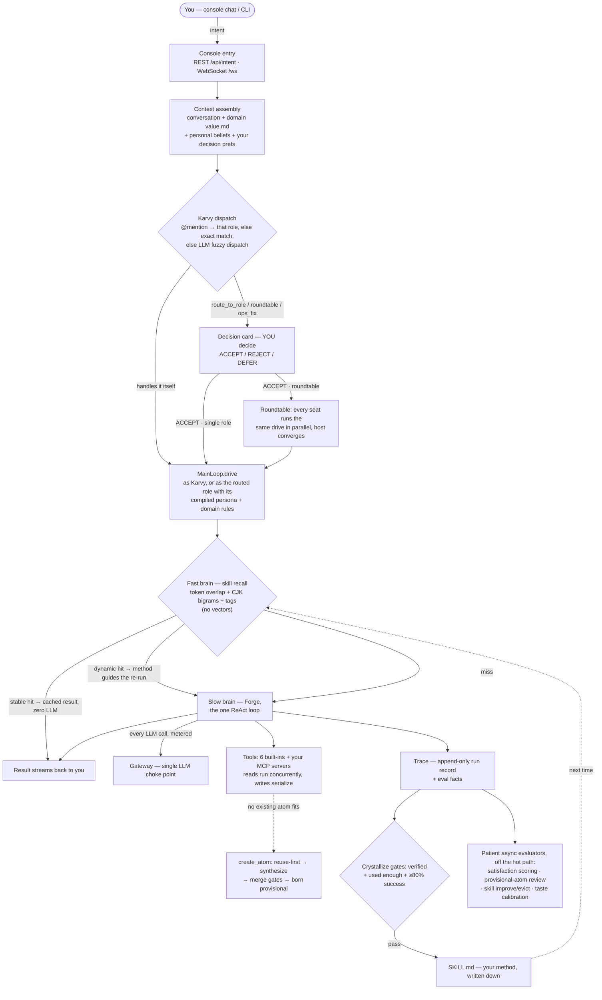
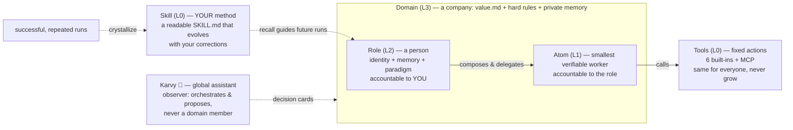

# KarvyLoop

> 🌐 **Language**: **English (current)** · [中文](README.zh-CN.md)

**A local-first, loop-native AI agent runtime — build a team of AI agents that run your work, verify themselves, and compound into skills that are _yours_, while you stay the one who decides.**

  

`AI agents` · `multi-agent orchestration` · `LLM runtime` · `loop engineering` · `local-first` · `human-in-the-loop` · `skill crystallization` · `MCP` · `sandboxed execution`

---

## What is KarvyLoop?

KarvyLoop is a runtime for **AI agents that run on your own machine**. You assemble a team — business *domains* (like companies) staffed by *roles* (agents with an identity and preferences), each built from *atoms* (single-responsibility sub-agents) — and a built-in assistant, **Karvy 🦫**, orchestrates them from plain language. It runs your repetitive work, **verifies its own output**, and **crystallizes every use into a version of _you_** (skills, knowledge, decision preferences) — all while a hard **human-in-the-loop** rule (the AI proposes, *you* decide) keeps you in the driver's seat.

Where most agent frameworks make a *single* LLM call more reliable, KarvyLoop is **loop-native**: the unit of design is the whole self-running cycle — *discover work → run it → verify → compound → (you decide) → repeat*. The companion chat surface is **KarvyChat**.

> Most AI tools sideline you, burn tokens, and feel the same for everyone. KarvyLoop keeps you in the driver's seat, stays affordable, and turns every use into a version of *you* that can't be copied.

## Features

- 🤖 **A team of AI agents, locally.** Create *domains* (companies) with *roles* (agents) composed of reusable *atoms* (sub-agents) — an OS-like L0→L4 entity ladder.
- 🧭 **Plain-language orchestration, you approve.** Tell Karvy *"get a few people in Product to analyze the competitor"* — it plans a single hand-off, a **roundtable** (agents think in parallel, then converge), a **workflow** (multi-step pipeline), or an **ops** check, and returns a **decision card**. Nothing runs until you confirm (**H2A**).
- 🔁 **Loop-native design.** Two loops with opposite natures — the *execution loop* (an atom does a job, self-verifies; fully automated) and the *decision loop* (role ↔ you; deliberately **not** automated). The role/atom split *is* that cut.
- 🧠 **Everything compounds into you.** Runs that pass a verify gate crystallize into reusable **skills**; your accept/reject/edit choices crystallize into **decision preferences** that pre-align future proposals. This is the moat — copyable code, **un-copyable instance**.
- 📬 **Decisions reach you — you don't chase them.** Pending cards wait on the console, and with the optional **email channel** they travel to your inbox as a digest with signed one-tap replies (works behind any NAT, no third-party service); a **weekly report card** sums up what your team ran, spent and learned, every number traceable. Stale cards age visibly instead of silently rotting.
- 🔍 **See why, not just what.** As you type, related skills and knowledge surface unprompted (pure local matching — zero extra LLM calls); every skill has a **lifecycle timeline** (crystallized → revised → rerun) so "why did my skill change" always has an answer.
- 📚 **Personal knowledge base + cognition graph.** Feed it links or notes; it distills them into searchable **beliefs** on a mesh graph (grep + concept overlap, **no vector DB**), browsable in the console.
- 🔌 **Multi-provider LLM gateway + MCP.** Any Anthropic- or OpenAI-compatible endpoint; one gateway choke-point meters every token. Plug in **MCP** servers and their tools reach every agent.
- 🔒 **Safe by construction.** Every task carries a capability token; file/network/process access is checked against it; third-party skills run in a **bubblewrap** (Linux) / **Seatbelt** (macOS) sandbox and are **integrity-locked** (a tampered skill directory is refused at both index and execution). The console rejects cross-origin browser requests (same-origin gate on HTTP + WebSocket) on top of the access token for non-local devices. Audit the whole surface in one table via the **Capability overview** card in the Skills panel. It sits below the agent's trust boundary — it can't be bypassed.
- 🏠 **Local-first & private.** Runs on `localhost`; your data lives in `~/.karvyloop/`, never uploaded. **MIT**-licensed; ships **by version** and never upgrades itself without your click.

### Supported platforms

| OS | Status |
|----|--------|
| **Linux** | ✅ First-class — full security sandbox (bubblewrap). |
| **macOS** | ✅ Supported — built-in Seatbelt sandbox (`sandbox-exec`), same fail-closed contract as Linux; newer, so rougher. |
| **Windows** | ✅ Supported (degraded) — runs fully; third-party skill scripts disabled (no sandbox yet); Linux/macOS get the full sandbox. |

KarvyLoop is a cross-platform user-space runtime (pure Python; it doesn't ride on the Linux kernel). The only platform-specific piece is the sandbox: **Linux uses bubblewrap, macOS uses the built-in `sandbox-exec`** — same write-isolation + network-gate behavior (macOS adversarially verified on Apple Silicon / macOS 26).

> ⚠️ **Early and under active development.** KarvyLoop is pre-1.0 and moving fast. Many features aren't fully tested yet and rough edges are expected — we're opening it up early to sharpen it together. **Bug reports are gold.** 🙏

---

## Quickstart

**Requirements**: Python 3.11+. Sandboxed skill execution needs Linux + `bubblewrap` or macOS (built-in `sandbox-exec`); everything else is cross-platform — Windows runs in degraded mode (third-party skill scripts disabled, all else works).

```bash
# 1) Install — puts `karvyloop` on your PATH, isolated (safe on PEP 668 / "externally managed" distros)
curl -fsSL https://raw.githubusercontent.com/Caprista/KarvyLoop/main/scripts/install.sh | bash
#    Windows (PowerShell):  irm https://raw.githubusercontent.com/Caprista/KarvyLoop/main/scripts/install.ps1 | iex
#    (developing against a clone instead?  pip install -e .  — but see "karvyloop not found?" below)

# 2) Configure a model (keys live OUTSIDE the repo)
mkdir -p ~/.karvyloop
$EDITOR ~/.karvyloop/config.yaml   # see "Minimal config" below

# 3) Run the local console (web UI)
karvyloop console --host 127.0.0.1 --port 8766
# open http://127.0.0.1:8766
```

**Minimal `~/.karvyloop/config.yaml`** (replace `${ANTHROPIC_KEY}` with an env var or literal key — **never commit a real key**):

```yaml
lang: en
models:
  providers:
    anthropic:
      base_url: https://api.anthropic.com
      auth_header: x-api-key
      messages_path: /v1/messages
      api_key: ${ANTHROPIC_KEY}
      models:
        - id: anthropic/claude
          name: Claude
          api: anthropic-messages
          context_window: 200000
          max_tokens: 8192
agents:
  defaults:
    model: anthropic/claude
embedding:
  model: anthropic/claude
```

> You can also manage models in the console (left nav 🤖 Models). Any Anthropic-compatible endpoint works; OpenAI-compatible endpoints use `api: openai-completions`.
> Just want to see the UI without a model? `karvyloop console --no-llm` (read-only, no key needed).

### Optional features (extras)

The base install runs the whole product. A few capabilities need an extra package — **all of them degrade gracefully when absent** (Karvy keeps working, you just don't get that one feature, and where you try to use it you get a clear "install X" message — never a crash). Install only what you need:

| Extra | Install | Unlocks | Without it |
|---|---|---|---|
| **mcp** | `pip install -e ".[mcp]"` (+ `pip install uv` for `uvx`) | Connect any [MCP](https://modelcontextprotocol.io) server; its tools are injected into every agent (keys prefixed `mcp_<server>_`) | MCP tools unavailable; using one returns a clear "install mcp" error |
| **web** | `pip install -e ".[web]"` then `playwright install chromium` | Real **runtime** verification of web output (`karvyloop verify-web`) — actually loads the page | Falls back to syntax-only checks; honestly tells you runtime wasn't verified |
| **redis** | `pip install -e ".[redis]"` | Cross-process / cross-machine agent collaboration (Redis A2A transport) | Auto-falls back to in-process transport — fine for a single process |
| **dev** | `pip install -e ".[dev]"` | Run the test suite (`pytest`, `respx`, …) | — (only needed to develop/test KarvyLoop) |

Combine them: `pip install -e ".[mcp,web]"`. None of these gate the core loop — chat, domains/roles, decisions, skills, and token accounting all work on the base install.

## Your first 15 minutes

No need to understand agents — here's the whole loop, end to end:

1. **Start & connect a model (~5 min).** `karvyloop console` → the setup screen asks where your AI comes from; pick a provider, it shows a "get a key (30s)" link, paste the key, it verifies it works. (Prefer running locally? Pick the local option and follow the install hint.) Your key lives in `~/.karvyloop/config.yaml`, never in any repo.
2. **Talk to Karvy.** In the private chat, ask for something small and concrete. It runs it and returns — that's the **execution loop**.
3. **Make a team.** Left nav → create a business **domain** (like a company) and give it a few **roles** (e.g. domain "Data", roles "Analyst" and "Reviewer").
4. **Hand off work.** Back in the private chat with Karvy, say something like *"hand the monthly report to the Analyst."* Karvy doesn't barge into the domain — it proposes routing it, and a **decision card** appears under 🤝.
5. **Decide.** The card tells you, in your terms, what it's about and on what basis; it shows a verified region (✓/✗) separate from Karvy's narration; your own standards are pre-aligned beside it. Accept / edit a criterion / reject — your call. It then shows up in 🗳 **Recent calls** so you can look back.
6. **It compounds.** Your accept/reject/edit choices crystallize into **decision preferences** that pre-align future proposals (you're asked less, re-explain yourself less); repeated tasks crystallize into **skills** a "fast brain" reuses — cheaper and more *you* each time.

---

## The idea — why "loop-native"

> This section is the *why*. If you just want to run it, everything above is enough — come back when you're curious what makes it different.

The industry climbed a ladder of paradigms: **prompt engineering → context engineering → harness engineering**. Each rung made a *single* LLM call more reliable. Today's agent runtimes are *harness-native*: they wrap one call in scaffolding — tools, ReAct, retries, guardrails — to make one agent dependable.

KarvyLoop is **loop-native**. The unit of design isn't a call or an agent — it's the whole self-running cycle that finds work, runs it, checks itself, and compounds:

```
discover work → run it → verify independently → COMPOUND (crystallize) → (you decide) → repeat
        ▲                                                                      │
        └──────────────── the loop gets cheaper & more "you" each turn ────────┘
```

That shift sounds incremental. It isn't — because of one uncomfortable fact about loops:

> **The same loop, in two people's hands, produces opposite outcomes.** For one it compounds into leverage. For the other it quietly takes over their judgment, one accepted suggestion at a time, until they can no longer tell whether the output is right — they've been automated out of their own work without noticing. A loop is not neutral. What decides which outcome you get is whether you stay the *engineer* of the loop or slide into being its *spectator*.

Everything below is how KarvyLoop is built so you stay the engineer.

> **Everyone is building agents that need you less. KarvyLoop builds the agent that learns how you decide — and proves it by never deciding for you.**

### Two loops, not one

Look closely and a running loop is really *two* loops with opposite natures:

- **The execution loop** — *how to do X.* An atom (L1) does one job and can write a verify gate for its own output. This loop is fully automatable, and it's becoming a commodity — everyone's execution loop converges to roughly the same thing.
- **The decision loop** — *whether, and on whose terms.* This runs between a role (L2) and you. It **can't** be automated, because automating it *is* the failure mode above. It's where your intent, taste, and accountability live.

How do you tell which loop something belongs to? One knife, and it never wavers: **"does it carry your responsibility?"** Direction, trade-offs, sign-off → decision loop, stays with you. Purely getting the work out → execution loop, goes to the machine.

So KarvyLoop automates the execution loop hard (cheap, fast, self-verifying) and **refuses** to automate the decision loop. The role/atom split in the architecture *is* this cut. **H2A** (the AI proposes, you decide) isn't a setting you can switch off — it's the structural guarantee that the decision loop stays yours.

One more consequence of taking the decision loop seriously: **if you ever have to ask "how's that task going?", the decision loop has already collapsed** — you've become the system's heartbeat monitor. Roles here work under a *resourceful subordinate* contract: hit a wall, exhaust self-help first (swap plan, swap atom, find or forge a skill); come back only when it's genuinely infeasible — **with evidence** ("tried these three routes, stuck here, need you to decide this"), never a silent hang, never a bare "failed". Blocked work surfaces itself; your attention is spent on *deciding*, not *checking up*.

### Staying the decider takes more than a yes/no button

A veto you can't exercise *intelligently* is theater. To really keep the wheel you have to **understand** the decision — but understanding can't mean "go read the tool logs." The distance between what the system did and what you can tell from its output is what Don Norman called the **Gulf of Evaluation**, and the obvious fixes make it worse:

- **The overtrust trap.** A large review of AI explanations (Microsoft, ~60 studies) found that *more* explanation increases reliance **regardless of whether the answer is correct** — a fluent rationale earns trust it hasn't deserved. "Just explain more" doesn't keep you in control; it lulls you out of it.
- **Over-judgment = no judgment.** Ask for a decision too often and the human either kills the loop or rubber-stamps everything — both are surrender. There's a narrow band between asking too little (silent autopilot) and too much (decision fatigue).

KarvyLoop's answer is a **translation layer** with two hard rules:

1. **Grounded, not trust-inducing.** What the loop claims to have *solved* may be shown as solved **only** when it passed a deterministic verify gate. Everything else is presented as Karvy's *narration* and visibly marked "not verified." Your phone isn't "slow because storage is full" — you're told what was actually checked, and what wasn't.
2. **Decision-forcing, not explanation-dumping.** The interface doesn't try to make you *trust* it; it makes you *judge*. It surfaces rarely (pure verified success doesn't interrupt you), and when it does it puts your own prior standards next to the call, asks you to keep / edit / drop the criteria, and **won't let a high-stakes accept be rubber-stamped**.

Concretely, this is the **decision card**: the problem and approach in your terms; a *verified* region (✓ / ✗, traceable to the gate) kept visibly separate from Karvy's narration; your own crystallized standards pre-aligned beside it; and a gate that stops a high-stakes "accept" you were about to wave through. That — not a checkbox — is what "you stay the decider" is actually made of.

> The verified ✓ region appears for a step that passed an **automatic verify gate**; many steps have nothing to auto-verify, so they show honestly as narration marked "not verified" rather than a fake ✓. That region lights up for more of your work as verify gates get wired into more flows — we'd rather show you less green than green you can't trust.

### The compounding wedge: two loops, two crystallizations

The two loops don't just run — each one **sediments**, and each sediments a different thing:

- **The execution loop crystallizes into skills** — *how you work.* Every run is observed; once it passes a verify gate and is used enough, it **crystallizes into a persistent skill**. Next time a "fast brain" hits it directly: cheaper, and shaped to you.

  And a rule we consider load-bearing: a skill stores **the method, never the answer**. Caching last quarter's competitor list and replaying it six months later isn't memory — it's **poisoning your own library** with stale conclusions. So a skill records *how you do it* (where to look, what to check, what counts as done), and every hit **re-runs the method on fresh inputs**. What compounds is your way of working — answers expire, methods don't.

- **The decision loop crystallizes into taste** — *how you decide.* Your accept / reject / edit choices crystallize into standards that **pre-align** future proposals, so you're asked less and re-explain yourself less. These are deliberately easy to revoke — a contradicting decision weakens or retires one — because the goal is to *fit* you, never to lock you in.

The first kind, others will eventually build. The second is the part almost no one else builds — and it's why the loop becomes **yours**, not merely good.

### The flywheel underneath: how it actually compounds

Crystallization and "you stay the decider" only work if something underneath keeps score honestly. That something is one substrate — the **Trace** — and a deliberate split of speed:

- **One source of truth.** An append-only Trace records everything: what each role and atom *did*, what you and the system *said*, what you and a role *decided*, the *method* an atom used, and what the system *learned* from all of it (learning writes back into the Trace too). Every evaluation derives from the Trace — nothing is scored off to the side. The Trace stays *readable* (so you, and the safety/verify machinery, can audit it); the moat is "your instance can't be lifted out," never "you can't read your own data".
- **Fast and slow, separated.** Running a task is urgent and must not pay for evaluating itself — so a drive only *executes and writes facts to the Trace*, and a patient learner reads the Trace **off the hot path** to score how things went. The fast side never waits on the slow side; the slow side (the patient "becoming more *you*" work) can take its time. (We borrow the *shape* of large-scale RL's actor/learner split — fast actor, patient learner, Trace as the log — **not the mechanism: nothing here trains model weights.**)
- **Evaluated along the chain of accountability.** A role answers to *you*, so **your decisions evaluate the role** (that's the decision-preference half of the wedge). An atom answers to its *role* — you don't even see what it did — so **the role's own objective measures evaluate the atom**: did the sub-goal land, faster, better, past its verify gate? Each layer is judged by the one it's responsible to, all of it read from the Trace.

This is the difference between *remembering what you repeated* (memory) and *learning what actually works for you* (the moat). The methods that prove out start to surface first; each turn the loop gets a little cheaper and a little more yours. The wedge is the promise — this flywheel is the proof it can keep it.

### Your assets, not someone else's agents

Software here is disposable — you describe what you want, it gets written, used, and discarded. What *stays* is the reusable shape underneath, crystallized into a library that's yours: skills (*how to do X*), decision preferences (*how you decide*), and the **roles & atoms** your work is built from.

Already invested in agents elsewhere? Bring them. An imported agent isn't flattened into a file — a model **decomposes it into a role** (its persona) **plus reusable atoms** (its capabilities), dropped into a shared pool any of your roles can compose. Near-duplicate atoms across roles get merged into one canonical atom — *you* confirm the merge, since it's your asset — and each atom is labeled honestly: *executable* (its tools are real and wired) or *advisory* (persona reasoning only), so "it ran" never masquerades as "it works".

That library — your roles, atoms, skills, and decision style — is the part that compounds into leverage and **can't be lifted out**.

### The moat: image vs instance

The code (the **image**) is open and copyable — it's this repo. The **instance** you grow on it — your memory, your skills, your decision style — is yours and can't be copied. Open source and the moat are consistent: we publish the image, never your instance.

---

## Architecture at a glance

**Entity model (an OS-like ladder, mirrored field-for-field in `karvyloop/schemas/`):**
- **L0 Tool / Skill** — a stateless capability unit. Ephemeral one-off tools and crystallized skills both live here.
- **L1 Atom** — the smallest "thinking unit": a single-responsibility agent you can write a verify gate for. This is the **execution loop** (fully automatable).
- **L2 Role** — atoms + a soul (identity/preferences). The role↔human boundary is the **decision loop** (not automatable — where the value compounds).
- **L3/L4 Domain / Sub-domain** — a long-lived "company/department" of collaborating agents, with shared values and guardrails.

**Runtime spine** — a request flows: `console (FastAPI REST + WebSocket) → MainLoop.drive → fast-brain recall (hit = zero LLM) or slow-brain Forge (ReAct) → gateway (multi-provider LLM) → sandbox (bubblewrap) + capability token → streamed back to the UI`. The gateway is the single choke-point for every LLM call, and it meters token usage there — so accounting rides on the gateway itself (any path that talks to a model is counted), not on an optional switch a caller could forget.

**Safety is foundational** — every task gets a capability token; all file/network/process access is checked against it; third-party skill scripts run in a sandbox with minimal grants (workspace only, no network unless you explicitly authorize). It sits below the agent's trust boundary — it can't be bypassed.

### How it runs — one request, end to end

Every box below is a real mechanism in this repo (nothing aspirational):



Where each box lives: entry `karvyloop/console/` (`routes.py`, `ws.py`) · dispatch `karvyloop/karvy/fuzzy_dispatch.py` · decision cards `karvyloop/karvy/h2a.py` + `console/proposal_handlers.py` · drive `karvyloop/runtime/main_loop.py` · recall `karvyloop/crystallize/recall.py` · Forge/ReAct `karvyloop/coding/forge.py` → `karvyloop/atoms/executor.py` · tools `karvyloop/coding/tools/` · create_atom `karvyloop/atoms/self_create.py` · crystallize + async eval `karvyloop/crystallize/` · provisional review `karvyloop/atoms/provisional.py`.

**When does a role create an atom?** `create_atom` is a runtime tool handed to the running agent (it is never itself an atom, so it never shows in a role's atom list). The model calls it only when no existing atom can do the job. What happens then, in order: **(1) reuse first** — the shared atom pool is searched and a match is returned instead of creating anything; **(2) synthesize** — the capability is condensed into a single-responsibility spec that may only reference the six real tools (it cannot invent tool names; if nothing coherent condenses, it fails empty rather than write garbage); **(3) merge gates** — a stricter lexical-overlap check plus a semantic-tag-overlap check catch near-duplicates and reuse them; **(4) provisional birth** — the new atom is created marked `provisional`. If the run fails or you reject the result, an unreferenced provisional atom is removed; if it succeeds, it's composed into the creating role, and a periodic review confirms atoms that roles actually reference and reverts orphans. Near-duplicate atoms across roles later surface as a **merge proposal** — rewired and deleted only after you ACCEPT (`atoms/self_create.py`, `atoms/provisional.py`, `atoms/consolidate.py`).

### How the pieces relate



The chain of accountability is **you ← role ← atom**: a role answers to you (judged by your feedback), an atom answers to its role (judged by objective outcomes). Tools are identical for every user and never grow; skills are yours and do.

### Built-in tools — the complete list

Six built-in tools (`karvyloop/atoms/tool_catalog.py` — that's all of them), plus whatever MCP servers you connect:

| Tool | What it does | Guardrail |
|---|---|---|
| `run_command` | run a shell command | command parsed & classified before running; destructive patterns blocked; long output spills to disk, long runs go to background |
| `read_file` | read a file with line numbers | read-only floor; records a snapshot so later writes can be checked |
| `write_file` | create/overwrite a file atomically | read-before-write enforced, aborts if the file changed since it was read |
| `edit_file` | exact string replacement in a file | read-before-write; the match must exist and be unique |
| `web_search` | search the web (keyless by default; pluggable providers) | read-only; timeout-capped |
| `web_fetch` | fetch a URL and extract readable text | HTTPS only; size- and timeout-capped |
| `create_atom` | *runtime-only:* mint a new atom when none fits | provisional birth + merge gates + post-run review (see above) |
| `mcp_<server>_<tool>` | tools from MCP servers *you* configured | workspace-write floor; namespaced so they can't shadow built-ins |

Every call is checked against the task's capability token (`karvyloop/capability/policy.py`): read-only tasks can't write, and any tool *not* in the policy table defaults to the strictest mode — effectively denied until someone consciously grants it a floor.

### Adding your own

| Add a… | How | Entry point |
|---|---|---|
| **Role** | instantiate a domain template, create one by hand, or import an existing agent — imports are LLM-decomposed into a role + reusable atoms, not flattened into a file | console → domains (`POST /api/domain/templates/instantiate`, `/api/role/create`, `/api/agent/import`) |
| **Atom** | usually you don't — roles mint them via `create_atom` when needed; you can also add one by hand or get them from an agent import; cross-role near-duplicates surface as merge proposals you confirm | console → atoms (`POST /api/atom/create`, `/api/atoms/consolidate/*`) |
| **Skill** | let it crystallize out of use (the default), or import an Agent Skills–standard `SKILL.md` folder / zip / git repo — imports are marked untrusted, integrity-locked, and sandboxed | console → skills (`POST /api/skill/import`, `/api/skill/sources`) |
| **Tool** | connect an MCP server: pick a one-click preset (filesystem, fetch, github, memory, time, sqlite) or add your own under `mcp.servers` in `~/.karvyloop/config.yaml`; built-ins are code — PRs welcome | console → models → MCP (`GET /api/mcp/presets`, `POST /api/mcp/preset/apply`) |

For the full picture, read the source — it's documented. The map below tells you where to look.

### Decision audit trail

Every decision you make (ACCEPT / REJECT / DEFER, and explicit preference REVOKE) is recorded to an append-only, on-disk log (`~/.karvyloop/decision_log.json`, retained up to 5000 entries) — because in a system that acts on your behalf, *which calls were yours* has to be answerable. Two read-only endpoints expose it:

- `GET /api/decisions/recent?limit=N` — the 🗳 "Recent calls" UI window (newest-first, ≤50).
- `GET /api/decisions/audit?since=<ts>&until=<ts>&decision=<ACCEPT|REJECT|DEFER|REVOKE>&limit=<N>` — **for external audit / compliance**: filter the full retained trail by time window and decision type. Each row carries `ts, decision, summary, reason, kind, domain, role, proposal_id`; the response includes `total` (retained count) so you can check completeness. Point any external auditing tool at this endpoint, or read the JSON file directly.

### Repository layout

```
README.md / README.zh-CN.md   ← you are here (en / zh)
LICENSE                       ← MIT
pyproject.toml                ← install / build
karvyloop/                    ← all source
  schemas/        data contracts (single source of types)
  gateway/        LLM gateway + model registry (multi-provider; keys only here)
  context/        token/context governance (compaction, budget, circuit breaker)
  atoms/          L1 atom runtime: the one ReAct loop everything reuses
  coding/         Forge coding executor (delegates to atoms; no second loop)
  capability/ sandbox/ platform/   safety: capability tokens + bubblewrap sandbox
  registry/       tool/skill registry + third-party skill import/sandbox-exec
  crystallize/    ⭐ the wedge: skill crystallization + decision-interface crystallization
  system_skills/  bundled, read-only system skills/atoms (ship with the product; a data reset never touches them)
  cognition/      Belief / Pursuit / Trace + spreading-activation mesh recall (graph, no vector DB)
  domain/ a2a/ karvy/   collaboration: business domains / A2A protocol / Karvy
  roles/ paradigm/ wizard/ adapter/   identity & paradigm layers
  console/        local web console (FastAPI REST + WebSocket + static SPA)
  runtime/ workbench/ cli/   core loop (fast/slow brain) + terminal TUI + CLI
  i18n/           bilingual (en/zh) presentation layer
tests/                        ← pytest suite (also the best usage examples)
```

---

## Updating

KarvyLoop ships **by version** ([CHANGELOG](CHANGELOG.md)), and it tells you when there's a newer one — but it **never upgrades itself**. Detect → notify → *you* decide. "Never upgrades itself" means the system won't act unprompted — not that you're stuck typing commands: once *you* click, it runs the whole thing for you.

- **How you find out**: the console shows a dismissible banner when a newer release exists; or run `karvyloop update` anytime. (It's a plain version check against GitHub Releases — no telemetry, no data sent. Turn it off with `KARVYLOOP_NO_UPDATE_CHECK=1`.)
- **One-click upgrade**: the banner has an **Upgrade** button — click it and the console runs the whole pipeline itself (stop → install → restart) and reconnects the page. No terminal needed. (Localhost-only, CSRF-guarded, single-flight; it's still *you* deciding — just without the command.)
- **Upgrades can't strand you.** Before switching versions the updater records the current commit and backs up your instance state files (`~/.karvyloop/backups/`, last 3 kept, scope declared in each backup's `manifest.json`); after installing it verifies the new code actually imports, and a broken build is **auto-rolled back** to the previous known-good version — with the reason stated out loud, never a silent broken restart. One-click rollback is also there: `POST /api/update/rollback`.
- **Or by hand**: from a clone → `git pull && pip install -e .`; from PyPI (once published) → `pip install -U karvyloop`. The banner also shows the exact command for your install.
- **Your data survives.** Everything you grow lives in `~/.karvyloop/` (config, beliefs, skills, roles/atoms, decision log) — outside the repo — and stays across upgrades. A breaking data change always ships with a migration and is called out loudly in the release notes.
- **Take it with you.** `karvyloop export` packs your whole instance (skills, knowledge, preferences, history) into one portable archive — API keys are deliberately left behind; unpack it into `~/.karvyloop` on the new machine and you're home.

## Running the tests

```bash
pip install -e ".[dev]"      # installs pytest / pytest-asyncio / respx / psutil
pytest -q                    # full suite — no flags needed
```

The suite is **self-contained**: it doesn't depend on any non-shipped docs, and optional infrastructure (e.g. the `mcp` package, redis, Linux+bubblewrap) is **skipped cleanly** rather than failing. Expect roughly **1880+ passed / a dozen skipped**. To run everything, on Linux: `pip install -e .` (puts the `karvyloop` CLI on PATH), `pip install mcp`, install `bubblewrap` and `redis`.

> A meta-guard test (`tests/test_suite_self_contained.py`) forbids any test from reading non-shipped docs, so "code-only checkouts stay green" is enforced, not hoped for.

## Front-end / back-end

Classic separation: the back end is FastAPI (`/api/*` REST + one `/ws` WebSocket, with auto-generated OpenAPI at `/docs`); the front end is a static SPA under `karvyloop/console/static/` that talks only via `fetch` + WebSocket. You can rebuild the front end in any framework against the same contract with zero back-end changes.

**Build (optional — only if you change the front end).** The console serves `karvyloop/console/static/` as-is, and the built assets are committed, so a normal install needs no Node. The SPA is being incrementally migrated to TypeScript + Vite (vanilla TS, no runtime framework) — source lives in `karvyloop/console/frontend/`, and each migrated module builds to a fixed-name bundle in `static/` keeping the same `window.Karvy*` global contract (so un-migrated `.js` keeps working). To rebuild after editing TS:

```bash
cd karvyloop/console/frontend
npm install
npm run verify   # typecheck + build → ../static + runtime smoke (jsdom)
```

> **Access & auth.** By default the console binds to `localhost` (this machine only). Local (loopback) requests are password-free; the moment you bind to your LAN (`--host 0.0.0.0`) to reach it from another device, access from a non-loopback address **requires a token** — a fresh token is minted each start; run `karvyloop url` on the host to get the token link. (LAN is *not* a trust boundary — anyone on your office/home network could otherwise reach it.) Exposing it on the public internet still needs TLS + your own reverse-proxy auth on top.
>
> **Away from home? (remote decisions.)** The token link only works on your local network — KarvyLoop deliberately opens no public port. For deciding on the go, use the built-in **email decision loop**: configure `channels.email` (below) and pending decision cards are mailed to you as a digest; each card carries pre-filled reply links (`ACCEPT / REJECT / DEFER` with a single-use, time-limited signed code), and the console polls your inbox — outbound connections only, so it works behind any NAT with **no port-forwarding, no tunnel, no third-party relay**; any mailbox works. High-risk cards (e.g. filesystem grants) are notify-only by design — those you confirm back at the console. For full console access from anywhere, a private mesh VPN such as [Tailscale](https://tailscale.com) or plain WireGuard also works (end-to-end encrypted between your own devices). What we recommend **against**: forwarding port 8766 on your router — the console's token auth is not designed to face the open internet alone.
>
> ```yaml
> # ~/.karvyloop/config.yaml — optional; unconfigured = feature fully off
> channels:
>   email:
>     enabled: true
>     to: you@example.com
>     smtp: { host: smtp.example.com, port: 465, user: bot@example.com, password: ${MAIL_APP_PASSWORD} }
>     imap: { host: imap.example.com, port: 993, user: bot@example.com, password: ${MAIL_APP_PASSWORD} }
> ```
>
> **`karvyloop` not found?** `pip install` puts the `karvyloop` command in your Python's `bin`/`Scripts` dir — which is on `PATH` for a system Python, but **not** if you installed into a non-activated venv or with `pip install --user` on a distro where `~/.local/bin` isn't on `PATH`. Two fixes: **(a)** `python -m karvyloop url` (using the *same* Python you installed with) always works, no `PATH` needed; **(b)** for a clean global `karvyloop` command, install via **pipx**: `pipx install karvyloop && pipx ensurepath` (pipx isolates it and puts it on your `PATH`). pip itself never edits your shell `PATH`.

## Contributing

Pull requests welcome. Before submitting: `pytest -q` must be green; user-facing strings go through the bilingual i18n tables. Real API keys never go in the repo — only `~/.karvyloop/config.yaml` (outside the repo); test fixtures use obviously-fake keys.

## License

[MIT](LICENSE). The code is open; your instance (the data and skills you grow) is yours.

---

🦫 **Karvy** is waiting in the seat next to yours.
