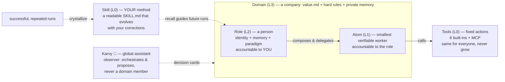

# KarvyLoop

> 🌐 **Language**: **English (current)** · [中文](README.zh-CN.md)

**A local-first, loop-native AI agent runtime — build a team of AI agents that run your work, verify themselves, and compound into skills that are _yours_, while you stay the one who decides.**

[](https://github.com/Caprista/KarvyLoop/actions/workflows/ci.yml)   

`AI agents` · `multi-agent orchestration` · `LLM runtime` · `loop engineering` · `local-first` · `human-in-the-loop` · `skill crystallization` · `MCP` · `sandboxed execution`

---

If you use AI for real work, you already know the tax: babysitting its output (surveys peg it at ~6.4 hours a week), re-explaining yourself to a tool that forgets you overnight, and a review pile that *grows* with everything you delegate. KarvyLoop is built to bend that curve the other way: **the longer you use it, the fewer approvals it asks of you — and the more accurate they get.**

## What is KarvyLoop?

KarvyLoop is a runtime for **AI agents that run on your own machine**. You assemble a team: business *domains* (a "company" — say, *Data Team*) staffed by *roles* (agents with an identity and preferences — an *Analyst*, a *Reviewer*), each built from *atoms* (sub-agents that do one checkable thing, like *fetch two CSVs and diff them*). A built-in assistant, **Karvy 🦫**, orchestrates them from plain language. It runs your repetitive work and **verifies its own output**, and every use **crystallizes into a version of _you_**: repeated tasks become *skills* (the third time you ask for a weekly summary, it's a written-down method reused for pennies), and your choices become *decision preferences* shown beside future calls. A hard **human-in-the-loop** rule — **H2A**: the AI proposes, *you* decide — means nothing runs until you accept a *decision card* (*"Hand the monthly report to the Analyst?"* — you click accept, then it moves).


*One 23-second loop: you accept a decision card, glance the 2×2 board, drop by the desk where your team works (day and night), and check the skill library's growth curve — more like you with every use.*

Where most agent frameworks make a *single* LLM call more reliable, KarvyLoop is **loop-native**: the unit of design is the whole self-running cycle — *discover work → run it → verify → compound → (you decide) → repeat*. The companion chat surface is **KarvyChat**.

> Most AI tools sideline you, burn tokens, and feel the same for everyone. KarvyLoop keeps you in the driver's seat, stays affordable, and turns every use into a version of *you* that can't be copied.

### If you've used other agent tools

- **AutoGen / CrewAI** are good at making several agents cooperate *inside one run*. KarvyLoop's unit is the recurring loop *across* runs: the 40th monthly report should be cheaper, better verified, and more aligned with you than the 1st.
- **LangGraph** gives you precise control flow inside a task graph. KarvyLoop focuses on what happens around and between tasks — verify gates, decision cards, and the residue each run leaves behind (skills, preferences) that compounds.
- **Manus** and similar autonomous agents run the "give it a goal and it works" promise in the cloud. KarvyLoop runs it on your machine, keeps you the decider by construction, and everything it learns lands in a local instance that is yours.

In one line: they optimize a single call or a single orchestration; KarvyLoop optimizes the whole loop that repeats — and makes the repetition compound.

## Features

- 🤖 **A team of AI agents, locally.** Create *domains* (companies) with *roles* (agents) composed of reusable *atoms* (sub-agents) — an OS-like L0→L4 entity ladder. There's even a **desktop view** where your agents sit at pixel-art workstations (Karvy the capybara at the hearth, carrying cards to you) — the team as a place, not a config screen.
- 🧭 **Plain-language orchestration, you approve.** Tell Karvy *"get a few people in Product to analyze the competitor"* — it plans a single hand-off, a **roundtable** (agents think in parallel, then converge), a **workflow** (multi-step pipeline), or an **ops** check, and returns a **decision card**. Nothing runs until you confirm (**H2A**). Long **workflows are interruptible** — cancel a run mid-flight and a restart won't quietly resurrect the version that was going wrong.
- 🔁 **Loop-native design.** Two loops with opposite natures — the *execution loop* (an atom does a job, self-verifies; fully automated) and the *decision loop* (role ↔ you; deliberately **not** automated). The role/atom split *is* that cut.
- 🧠 **Everything compounds into a version of you.** Runs that pass a verify gate crystallize into reusable **skills** — and skills stop being lonely Top-1 hits: a matched skill now pulls in up to two **supporting skills** so the library gains interest, not just entries. Your accept/reject/edit choices crystallize into **decision preferences** that pre-align future proposals; **roles** sediment their own domain-scoped experience (an Analyst gets sharper *at being your Analyst*, not just globally); and your knowledge **resolves its own conflicts** — say you're vegetarian now, and last year's "loves steak" is superseded (kept in history, dropped from recall) instead of contradicting itself forever. Copyable code, **un-copyable instance** — your instance, your data.
- 📬 **Decisions reach you — you don't chase them.** Pending cards wait on the console, and with the optional **email channel** they travel to your inbox as a digest with signed one-tap replies (works behind any NAT, no third-party service); a **weekly report card** sums up what your team ran, spent and learned, every number traceable. Stale cards age visibly instead of silently rotting.
- 🤫 **It's learning when to *not* ask you.** The hit-rate on Karvy's predicted calls isn't just a mirror — per kind of decision, once it's been right enough for long enough (Wilson 95% lower bound ≥ 0.90 over ≥35 cases — a statistical gate, not a streak) it *offers* to handle that bucket quietly. You grant that silence explicitly (it's never auto-taken, high-risk actions are excluded, and a single miss revokes it) — so over time it starts earning the right to stop interrupting you on the calls it has already learned you'd make.
- 🛑 **You stay in the driver's seat — even on long, unattended runs.** A **spend brake** enforces hard token/cost limits right at the gateway: a runaway background workflow *fail-stops* at the ceiling (foreground work you're waiting on is never blocked — so you can hand it the key without fear). A domain's hard rules (**deontic** *"never place a trade"*) are a **deterministic gate** on the tools and commands themselves, not a line in a prompt you hope the model obeys. And a built-in **doctor** (`karvyloop doctor --fix`) repairs the safe, deterministic breakages itself and probes liveness (is the model endpoint actually reachable?), so a broken setup tells you *why* instead of failing mute.
- 🔍 **See why, not just what.** As you type, related skills and knowledge surface unprompted (pure local matching — zero extra LLM calls); every skill has a **lifecycle timeline** (crystallized → revised → rerun) so "why did my skill change" always has an answer.
- 📚 **Personal knowledge base + cognition graph.** Feed it links or notes; it distills them into searchable **beliefs** on a mesh graph (grep + concept overlap, **no vector DB**), browsable in the console.
- 🔌 **Multi-provider LLM gateway + MCP.** Any Anthropic- or OpenAI-compatible endpoint; one gateway choke-point meters every token — and **caches the stable prefix** of every call (system + tools tail), so repeated runs read it back from provider cache and cut that slice of input cost by ~80–90% (it's cheaper to keep using). Plug in **MCP** servers and their tools reach every agent — **local (stdio) or vendor-hosted remote** (paste a streamable-HTTP URL + optional token, no local process to run).
- 🔒 **Safe by construction.** Every task carries a capability token; file/network/process access is checked against it; third-party skills run in a **bubblewrap** (Linux) / **Seatbelt** (macOS) sandbox and are **integrity-locked** (a tampered skill directory is refused at both index and execution). The console rejects cross-origin browser requests (same-origin gate on HTTP + WebSocket) on top of the access token for non-local devices. Audit the whole surface in one table via the **Capability overview** card in the Skills panel. It sits below the agent's trust boundary — it can't be bypassed.
- 🏠 **Local-first & private.** Runs on `localhost`; your data lives in `~/.karvyloop/`, never uploaded. **MIT**-licensed; ships **by version** and never upgrades itself without your click.

### Supported platforms

| OS | Status |
|----|--------|
| **Linux** | ✅ First-class — full security sandbox (bubblewrap). |
| **macOS** | ✅ Supported — built-in Seatbelt sandbox (`sandbox-exec`), same fail-closed contract as Linux; newer, so rougher. |
| **Windows** | ✅ Supported — a restricted-token sandbox (write isolation via `WRITE_RESTRICTED` token + per-directory ACL whitelist, resource limits via a Job Object) runs skill scripts when it's available; where it isn't (locked-down policy / AV interference), it falls back to a degraded mode that keeps first-party workspace read/write/exec working and fail-closes third-party skill scripts. Honest limits: no admin-free network gate on Windows yet, so a skill that needs network **fail-closes** here (run it on Linux/macOS); read isolation is relaxed (as on macOS); it defends against mistakes and ordinary untrusted scripts, not a determined escape. |

KarvyLoop is a cross-platform user-space runtime (pure Python; it doesn't ride on the Linux kernel). The only platform-specific piece is the sandbox: **Linux uses bubblewrap, macOS uses the built-in `sandbox-exec`, Windows uses a restricted-token + Job Object sandbox** — same default-deny-write + network-gate contract (Linux/macOS network gate is full; Windows fail-closes network rather than pretend). macOS adversarially verified on Apple Silicon / macOS 26; Windows write isolation + resource limits adversarially verified on Win11 Home.

> ⚠️ **Early and under active development.** KarvyLoop is pre-1.0 and moving fast. Many features aren't fully tested yet and rough edges are expected — we're opening it up early to sharpen it together. **Bug reports are gold.** 🙏

---

## Quickstart

**Requirements**: Python 3.11+. Sandboxed skill execution uses Linux + `bubblewrap`, macOS (built-in `sandbox-exec`), or Windows (built-in restricted-token + Job Object sandbox — no extra dependency); everything else is cross-platform. On Windows, skills that need network fail-close (no admin-free network gate yet); where the restricted-token sandbox can't initialize, it degrades to first-party-only with third-party skill scripts disabled.

```bash
# 1) Install — puts `karvyloop` on your PATH, isolated (safe on PEP 668 / "externally managed" distros)
curl -fsSL https://raw.githubusercontent.com/Caprista/KarvyLoop/main/scripts/install.sh | bash
#    Windows (PowerShell):  irm https://raw.githubusercontent.com/Caprista/KarvyLoop/main/scripts/install.ps1 | iex
#    (developing against a clone instead?  pip install -e .  — but see "karvyloop not found?" below)

# 2) Configure a model (keys live OUTSIDE the repo)
mkdir -p ~/.karvyloop
$EDITOR ~/.karvyloop/config.yaml   # see "Minimal config" below

# 3) Run the local console (web UI)
karvyloop console --host 127.0.0.1 --port 8766
# open http://127.0.0.1:8766
```

**Minimal `~/.karvyloop/config.yaml`** (replace `${ANTHROPIC_KEY}` with an env var or literal key — **never commit a real key**):

```yaml
lang: en
models:
  providers:
    anthropic:
      base_url: https://api.anthropic.com
      auth_header: x-api-key
      messages_path: /v1/messages
      api_key: ${ANTHROPIC_KEY}
      models:
        - id: anthropic/claude
          name: Claude
          api: anthropic-messages
          context_window: 200000
          max_tokens: 8192
agents:
  defaults:
    model: anthropic/claude
embedding:
  model: anthropic/claude
```

> You can also manage models in the console (left nav 🤖 Models). Any Anthropic-compatible endpoint works; OpenAI-compatible endpoints use `api: openai-completions`.
> Just want to see the UI without a model? `karvyloop console --no-llm` (read-only, no key needed).

## Your first 5 minutes

The whole loop, one pass — roughly a minute per step:

1. **Install & connect** (Quickstart above). *You should see:* the console opens, verifies your key, and Karvy greets you.
2. **Say one small, concrete thing** to Karvy in the private chat — e.g. *"list the 5 largest files in my workspace."* *You should see:* it runs and streams the result back. That's the **execution loop**.
3. **Give it something to route.** Create a domain with one role from the left nav (30 seconds), then tell Karvy *"hand the monthly report to the Analyst."* *You should see:* Karvy doesn't act — a **decision card** appears under 🤝 with what it's about and on what basis.
4. **Decide.** Accept as-is, or edit a line first (*"…and keep it under 200 words"*). *You should see:* the work runs, and your call lands in 🗳 **Recent calls**.
5. **Come back later.** *You should see:* your edit has become a standard shown beside the next card, and the repeated task is on its way to becoming a **skill**. You get asked less, and more precisely — that's the point.

Want the same journey slower, with more of the why? See [the guided first 15 minutes](#your-first-15-minutes-guided) below.

### Optional features (extras)

The base install runs the whole product. A few capabilities need an extra package — **all of them degrade gracefully when absent** (Karvy keeps working, you just don't get that one feature, and where you try to use it you get a clear "install X" message — never a crash). Install only what you need:

| Extra | Install | Unlocks | Without it |
|---|---|---|---|
| **mcp** | `pip install -e ".[mcp]"` (+ `pip install uv` for `uvx`) | Connect any [MCP](https://modelcontextprotocol.io) server — local stdio (`command`) **or vendor-hosted remote over streamable HTTP** (`url` + optional bearer token); tools are injected into every agent (keys prefixed `mcp_<server>_`) | MCP tools unavailable; using one returns a clear "install mcp" error |
| **web** | `pip install -e ".[web]"` then `playwright install chromium` | Real **runtime** verification of web output (`karvyloop verify-web`) — actually loads the page | Falls back to syntax-only checks; honestly tells you runtime wasn't verified |
| **redis** | `pip install -e ".[redis]"` | Cross-process / cross-machine agent collaboration (Redis A2A transport) | Auto-falls back to in-process transport — fine for a single process |
| **relay** | `pip install -e ".[relay]"` | End-to-end encryption for the Karvy messenger relay: reach your console from anywhere via `karvyloop console --relay` + `karvyloop relay-pair` (the relay itself — `karvyloop relay-serve` — is stateless, blind-forwarding, and needs no extra) | `--relay` / `relay-pair` refuse with a clear "pip install karvyloop[relay]" message |
| **files** | `pip install -e ".[files]"` | Real attachment parsing: PDF / Word (.docx) / Excel (.xlsx) are extracted to text for the files-panel preview and for agents analyzing them (CSV/plain text need nothing extra); corrupted or mislabeled files are refused with a clear error — never binary garbage | Previewing/reading those formats returns a clear "pip install karvyloop[files]" message |
| **asr** | `pip install -e ".[asr]"` | **Local audio transcription** ([faster-whisper](https://github.com/SYSTRAN/faster-whisper), MIT): meeting recordings / voice memos (mp3/wav/m4a) become text on your machine — same attachment pipeline as PDFs, so the files panel previews them and roles (e.g. meeting-notes) consume the transcript. First use downloads a speech model (default `small`, ≈480 MB; `KARVYLOOP_ASR_MODEL` picks another); CPU is enough, nothing is uploaded | Audio files return a clear "pip install karvyloop[asr]" message — never fabricated transcripts |
| **dev** | `pip install -e ".[dev]"` | Run the test suite (`pytest`, `respx`, …) | — (only needed to develop/test KarvyLoop) |

Combine them: `pip install -e ".[mcp,web]"`. None of these gate the core loop — chat, domains/roles, decisions, skills, and token accounting all work on the base install.

You don't need to memorize this table: the console has an **"Unlock more capabilities"** panel (Skill Library → 🔓, also linked from Diagnose and at the end of the first-10-minutes journey) that detects each capability's live status — ready / not set up / needs install — and shows exactly what each one is worth and how to get it, including where to find MCP servers (the [official registry](https://registry.modelcontextprotocol.io/) and community directories like [PulseMCP](https://www.pulsemcp.com/servers) and [Glama](https://glama.ai/mcp/servers)).

### Optional: connect your own external AI runtime (BYO)

**Installing KarvyLoop is one command** (the Quickstart above). **Connecting an external AI runtime is a separate, on-demand step** — and it's entirely optional.

Beyond its own agents, KarvyLoop can treat a **third-party headless CLI agent you already run** (any of the various headless CLI agents out there) as a channel participant: you `@` it for work and see it run. That external runtime is **software you bring yourself** — **KarvyLoop does not bundle, host, download, or ship it.** You install it from its **own official source**, on your own terms; we only point you there.

By design, an external runtime stays an **opaque, untrusted executor**: its output is untrusted data, it never takes a decision seat, and it never touches your memory or crystallized skills (those are the moat). You manage connected runtimes from the console's **External Runtimes** panel (🔌 in the left nav) — each shows a distinct **external** badge so it's never mistaken for a native role, plus a live status light, a direct-chat button, and a remove button. The Diagnose panel and that same panel detect whether a compatible runtime is installed and, if not, walk you through connecting one from its official docs.

- What we ship: the **bridge, adapters, and management UI** to connect one — and honest guidance on where to get it.
- What we don't ship: **the runtime itself.** No vendoring, no hosting, no `git clone` of anyone's code.

<a id="your-first-15-minutes-guided"></a>
## Your first 15 minutes (guided)

The same loop as ["Your first 5 minutes"](#your-first-5-minutes), unhurried — no need to understand agents:

1. **Start & connect a model (~5 min).** `karvyloop console` → the setup screen asks where your AI comes from; pick a provider, it shows a "get a key (30s)" link, paste the key, it verifies it works. (Prefer running locally? Pick the local option and follow the install hint.) Your key lives in `~/.karvyloop/config.yaml`, never in any repo.
2. **Talk to Karvy.** In the private chat, ask for something small and concrete. It runs it and returns — that's the **execution loop**.
3. **Make a team.** Left nav → create a business **domain** (like a company) and give it a few **roles** (e.g. domain "Data", roles "Analyst" and "Reviewer").
4. **Hand off work.** Back in the private chat with Karvy, say something like *"hand the monthly report to the Analyst."* Karvy doesn't barge into the domain — it proposes routing it, and a **decision card** appears under 🤝.
5. **Decide.** The card tells you, in your terms, what it's about and on what basis; it shows a verified region (✓/✗) separate from Karvy's narration; your own standards are pre-aligned beside it. Accept / edit a criterion / reject — your call. It then shows up in 🗳 **Recent calls** so you can look back.

   

6. **It compounds.** Your accept/reject/edit choices crystallize into **decision preferences** that pre-align future proposals (you're asked less, re-explain yourself less); repeated tasks crystallize into **skills** a "fast brain" reuses — cheaper and more *you* each time.

   

---

## Why "loop-native" — the short version

> The full essay lives in [docs/PHILOSOPHY.md](docs/PHILOSOPHY.md). Here's the skeleton, one idea per line.

- **The industry optimizes a call; we optimize the cycle.** Prompt → context → harness engineering each made *one* LLM call more reliable. KarvyLoop's unit of design is the loop that repeats — *discover → run → verify → compound → (you decide) → repeat* — because your report is due again next Monday.
- **A loop is not neutral.** The same loop makes one person leveraged and quietly automates another out of their own judgment, one accepted suggestion at a time. Everything here is built to keep you the loop's *engineer*, not its spectator.
- **Two loops, split by one question: does it carry your responsibility?** *How to fetch and diff the numbers* → execution loop, automated hard. *Whether the report goes out under your name* → decision loop, never automated. That's what **H2A** is structurally.
- **No "how's that task going?".** If you have to ask, the decision loop has already collapsed. Blocked work surfaces itself with evidence — *"tried three routes, stuck here, need you to decide this"* — never a silent hang.
- **A veto you can't exercise intelligently is theater.** More AI explanation increases trust whether or not the answer is right (the overtrust trap). So the **decision card** shows only gate-verified claims as ✓, marks the rest honestly "not verified", and puts your own past standards beside the call.
- **Two crystallizations.** Runs compound into **skills** — the *method*, never the cached answer (a stale competitor list replayed six months later is poison; a hit re-runs the method on fresh inputs). Your accepts/rejects/edits compound into **decision preferences** — *"never email a client directly"* pre-aligns every future proposal.
- **One honest scorekeeper.** An append-only **Trace** records everything; evaluation happens off the hot path; each layer is judged by whoever it answers to — you judge roles, roles judge atoms.
- **Image vs instance.** The code is open and copyable — it's this repo. The instance you grow on it — memory, skills, decision style — can't be lifted out.

Want the argument, the failure modes, and the receipts behind each line? → **[docs/PHILOSOPHY.md](docs/PHILOSOPHY.md)**

---

## Architecture at a glance

**Entity model (an OS-like ladder, mirrored field-for-field in `karvyloop/schemas/`):**
- **L0 Tool / Skill** — a stateless capability unit. Ephemeral one-off tools and crystallized skills both live here.
- **L1 Atom** — the smallest "thinking unit": a single-responsibility agent you can write a verify gate for. This is the **execution loop** (fully automatable).
- **L2 Role** — atoms + a soul (identity/preferences). The role↔human boundary is the **decision loop** (not automatable — where the value compounds).
- **L3/L4 Domain / Sub-domain** — a long-lived "company/department" of collaborating agents, with shared values and guardrails.

**Runtime spine** — a request flows: `console (FastAPI REST + WebSocket) → MainLoop.drive → fast-brain recall (hit = zero LLM) or slow-brain Forge (ReAct) → gateway (multi-provider LLM) → sandbox (bubblewrap) + capability token → streamed back to the UI`. The gateway is the single choke-point for every LLM call, and it meters token usage there — so accounting rides on the gateway itself (any path that talks to a model is counted), not on an optional switch a caller could forget.

**Safety is foundational** — every task gets a capability token; all file/network/process access is checked against it; third-party skill scripts run in a sandbox with minimal grants (workspace only, no network unless you explicitly authorize). It sits below the agent's trust boundary — it can't be bypassed.

### How it runs — one request, end to end

Every box below is a real mechanism in this repo (nothing aspirational):


Where each box lives: entry `karvyloop/console/` (`routes.py`, `ws.py`) · dispatch `karvyloop/karvy/fuzzy_dispatch.py` · decision cards `karvyloop/karvy/h2a.py` + `console/proposal_handlers.py` · drive `karvyloop/runtime/main_loop.py` · recall `karvyloop/crystallize/recall.py` · Forge/ReAct `karvyloop/coding/forge.py` → `karvyloop/atoms/executor.py` · tools `karvyloop/coding/tools/` · create_atom `karvyloop/atoms/self_create.py` · crystallize + async eval `karvyloop/crystallize/` · provisional review `karvyloop/atoms/provisional.py`.

**When does a role create an atom?** `create_atom` is a runtime tool handed to the running agent (it is never itself an atom, so it never shows in a role's atom list). The model calls it only when no existing atom can do the job. What happens then, in order: **(1) reuse first** — the shared atom pool is searched and a match is returned instead of creating anything; **(2) synthesize** — the capability is condensed into a single-responsibility spec that may only reference the six real tools (it cannot invent tool names; if nothing coherent condenses, it fails empty rather than write garbage); **(3) merge gates** — a stricter lexical-overlap check plus a semantic-tag-overlap check catch near-duplicates and reuse them; **(4) provisional birth** — the new atom is created marked `provisional`. If the run fails or you reject the result, an unreferenced provisional atom is removed; if it succeeds, it's composed into the creating role, and a periodic review confirms atoms that roles actually reference and reverts orphans. Near-duplicate atoms across roles later surface as a **merge proposal** — rewired and deleted only after you ACCEPT (`atoms/self_create.py`, `atoms/provisional.py`, `atoms/consolidate.py`).

### How the pieces relate



The chain of accountability is **you ← role ← atom**: a role answers to you (judged by your feedback), an atom answers to its role (judged by objective outcomes). Tools are identical for every user and never grow; skills are yours and do.

### Built-in tools — the complete list

Six built-in tools (`karvyloop/atoms/tool_catalog.py` — that's all of them), plus whatever MCP servers you connect:

| Tool | What it does | Guardrail |
|---|---|---|
| `run_command` | run a shell command | command parsed & classified before running; destructive patterns blocked; long output spills to disk, long runs go to background |
| `read_file` | read a file with line numbers | read-only floor; records a snapshot so later writes can be checked |
| `write_file` | create/overwrite a file atomically | read-before-write enforced, aborts if the file changed since it was read |
| `edit_file` | exact string replacement in a file | read-before-write; the match must exist and be unique |
| `web_search` | search the web (keyless by default; pluggable providers) | read-only; timeout-capped |
| `web_fetch` | fetch a URL and extract readable text | HTTPS only; size- and timeout-capped |
| `create_atom` | *runtime-only:* mint a new atom when none fits | provisional birth + merge gates + post-run review (see above) |
| `mcp_<server>_<tool>` | tools from MCP servers *you* configured | workspace-write floor; namespaced so they can't shadow built-ins |

Every call is checked against the task's capability token (`karvyloop/capability/policy.py`): read-only tasks can't write, and any tool *not* in the policy table defaults to the strictest mode — effectively denied until someone consciously grants it a floor.

### Adding your own

| Add a… | How | Entry point |
|---|---|---|
| **Role** | instantiate a domain template, create one by hand, or import an existing agent — imports are LLM-decomposed into a role + reusable atoms, not flattened into a file | console → domains (`POST /api/domain/templates/instantiate`, `/api/role/create`, `/api/agent/import`) |
| **Atom** | usually you don't — roles mint them via `create_atom` when needed; you can also add one by hand or get them from an agent import; cross-role near-duplicates surface as merge proposals you confirm | console → atoms (`POST /api/atom/create`, `/api/atoms/consolidate/*`) |
| **Skill** | let it crystallize out of use (the default), or import an Agent Skills–standard `SKILL.md` folder / zip / git repo — imports are marked untrusted, integrity-locked, and sandboxed | console → skills (`POST /api/skill/import`, `/api/skill/sources`) |
| **Tool** | connect an MCP server: pick a one-click preset (filesystem, fetch, github, memory, time, sqlite), **paste a hosted server's URL + optional token** (streamable HTTP; token lives only in config.yaml, never echoed or logged), or hand-edit `mcp.servers` in `~/.karvyloop/config.yaml`; built-ins are code — PRs welcome | console → models → MCP (`GET /api/mcp/presets`, `POST /api/mcp/preset/apply`, `POST /api/mcp/server/add`) |

For the full picture, read the source — it's documented. The map below tells you where to look.

### Decision audit trail

Every decision you make (ACCEPT / REJECT / DEFER, and explicit preference REVOKE) is recorded to an append-only, on-disk log (`~/.karvyloop/decision_log.json`, retained up to 5000 entries) — because in a system that acts on your behalf, *which calls were yours* has to be answerable. Two read-only endpoints expose it:

- `GET /api/decisions/recent?limit=N` — the 🗳 "Recent calls" UI window (newest-first, ≤50).
- `GET /api/decisions/audit?since=<ts>&until=<ts>&decision=<ACCEPT|REJECT|DEFER|REVOKE>&limit=<N>` — **for external audit / compliance**: filter the full retained trail by time window and decision type. Each row carries `ts, decision, summary, reason, kind, domain, role, proposal_id`; the response includes `total` (retained count) so you can check completeness. Point any external auditing tool at this endpoint, or read the JSON file directly.

### Repository layout

```
README.md / README.zh-CN.md   ← you are here (en / zh)
LICENSE                       ← MIT
pyproject.toml                ← install / build
karvyloop/                    ← all source
  schemas/        data contracts (single source of types)
  gateway/        LLM gateway + model registry (multi-provider; keys only here)
  context/        token/context governance (compaction, budget, circuit breaker)
  atoms/          L1 atom runtime: the one ReAct loop everything reuses
  coding/         Forge coding executor (delegates to atoms; no second loop)
  capability/ sandbox/ platform/   safety: capability tokens + bubblewrap sandbox
  registry/       tool/skill registry + third-party skill import/sandbox-exec
  crystallize/    ⭐ the wedge: skill crystallization + decision-interface crystallization
  system_skills/  bundled, read-only system skills/atoms (ship with the product; a data reset never touches them)
  system_residents/  bundled, read-only resident mirrors (📁 File Butler; moving in = you accept a referral card, then a normal role instantiation)
  cognition/      Belief / Pursuit / Trace + spreading-activation mesh recall (graph, no vector DB)
  domain/ a2a/ karvy/   collaboration: business domains / A2A protocol / Karvy
  roles/ paradigm/ wizard/ adapter/   identity & paradigm layers
  console/        local web console (FastAPI REST + WebSocket + static SPA)
  runtime/ workbench/ cli/   core loop (fast/slow brain) + terminal TUI + CLI
  i18n/           bilingual (en/zh) presentation layer
tests/                        ← pytest suite (also the best usage examples)
```

---

## Updating

KarvyLoop ships **by version** ([CHANGELOG](CHANGELOG.md)), and it tells you when there's a newer one — but it **never upgrades itself**. Detect → notify → *you* decide. "Never upgrades itself" means the system won't act unprompted — not that you're stuck typing commands: once *you* click, it runs the whole thing for you.

- **How you find out**: the console shows a dismissible banner when a newer release exists; or run `karvyloop update` anytime. (It's a plain version check against GitHub Releases — no telemetry, no data sent. Turn it off with `KARVYLOOP_NO_UPDATE_CHECK=1`.)
- **One-click upgrade**: the banner has an **Upgrade** button — click it and the console runs the whole pipeline itself (stop → install → restart) and reconnects the page. No terminal needed. (Localhost-only, CSRF-guarded, single-flight; it's still *you* deciding — just without the command.)
- **Upgrades can't strand you.** Before switching versions the updater records the current commit and backs up your instance state files (`~/.karvyloop/backups/`, last 3 kept, scope declared in each backup's `manifest.json`); after installing it verifies the new code actually imports, and a broken build is **auto-rolled back** to the previous known-good version — with the reason stated out loud, never a silent broken restart. One-click rollback is also there: `POST /api/update/rollback`.
- **Or by hand**: from a clone → `git pull && pip install -e .`; from PyPI (once published) → `pip install -U karvyloop`. The banner also shows the exact command for your install.
- **Your data survives.** Everything you grow lives in `~/.karvyloop/` (config, beliefs, skills, roles/atoms, decision log) — outside the repo — and stays across upgrades. A breaking data change always ships with a migration and is called out loudly in the release notes.
- **Take it with you.** `karvyloop export` packs your whole instance (skills, knowledge, preferences, history) into one portable archive — API keys are deliberately left behind; unpack it into `~/.karvyloop` on the new machine and you're home.
- **One-command return trip.** `karvyloop import <archive>` unpacks it back into `~/.karvyloop` for you — path-safe, never touches your local `config.yaml`, and refuses to clobber an existing instance unless you say `--force` (`--dry-run` shows the plan first).

## Running the tests

```bash
pip install -e ".[dev]"      # installs pytest / pytest-asyncio / respx / psutil
pytest -q                    # full suite — no flags needed
```

The suite is **self-contained**: it doesn't depend on any non-shipped docs, and optional infrastructure (e.g. the `mcp` package, redis, Linux+bubblewrap) is **skipped cleanly** rather than failing. Expect roughly **1880+ passed / a dozen skipped**. To run everything, on Linux: `pip install -e .` (puts the `karvyloop` CLI on PATH), `pip install mcp`, install `bubblewrap` and `redis`.

> A meta-guard test (`tests/test_suite_self_contained.py`) forbids any test from reading non-shipped docs, so "code-only checkouts stay green" is enforced, not hoped for.

## Front-end / back-end

Classic separation: the back end is FastAPI (`/api/*` REST + one `/ws` WebSocket, with auto-generated OpenAPI at `/docs`); the front end is a static SPA under `karvyloop/console/static/` that talks only via `fetch` + WebSocket. You can rebuild the front end in any framework against the same contract with zero back-end changes.

**Build (optional — only if you change the front end).** The console serves `karvyloop/console/static/` as-is, and the built assets are committed, so a normal install needs no Node. The SPA is being incrementally migrated to TypeScript + Vite (vanilla TS, no runtime framework) — source lives in `karvyloop/console/frontend/`, and each migrated module builds to a fixed-name bundle in `static/` keeping the same `window.Karvy*` global contract (so un-migrated `.js` keeps working). To rebuild after editing TS:

```bash
cd karvyloop/console/frontend
npm install
npm run verify   # typecheck + build → ../static + runtime smoke (jsdom)
```

> **Access & auth.** By default the console binds to `localhost` (this machine only). Local (loopback) requests are password-free; the moment you bind to your LAN (`--host 0.0.0.0`) to reach it from another device, access from a non-loopback address **requires a token** — a fresh token is minted each start; run `karvyloop url` on the host to get the token link. (LAN is *not* a trust boundary — anyone on your office/home network could otherwise reach it.) Exposing it on the public internet still needs TLS + your own reverse-proxy auth on top.
>
> **Away from home? (remote decisions.)** The token link only works on your local network — KarvyLoop deliberately opens no public port. For deciding on the go, use the built-in **email decision loop**: configure `channels.email` (below) and pending decision cards are mailed to you as a digest; each card carries pre-filled reply links (`ACCEPT / REJECT / DEFER` with a single-use, time-limited signed code), and the console polls your inbox — outbound connections only, so it works behind any NAT with **no port-forwarding, no tunnel, no third-party relay**; any mailbox works. High-risk cards (e.g. filesystem grants) are notify-only by design — those you confirm back at the console. For full console access from anywhere, a private mesh VPN such as [Tailscale](https://tailscale.com) or plain WireGuard also works (end-to-end encrypted between your own devices). What we recommend **against**: forwarding port 8766 on your router — the console's token auth is not designed to face the open internet alone.
>
> **Prefer push notifications? (webhook channel.)** Next to email there's a generic **outbound webhook channel**: pending decision cards are pushed as one digest (title, per-card summaries, value level, and a link back to your console) to any HTTP endpoint you configure. One channel covers the mainstream receivers via built-in presets — `ntfy`, `bark`, `slack` (Slack-compatible incoming webhooks: Discord's `/slack` endpoint, Mattermost, …) and `generic` (full JSON) — or set a custom `body_template` for anything else (e.g. Feishu/Lark bots). And the channel can carry your decision back, too: set `reply_url` to a poll-style reply source (e.g. a private ntfy topic's `/json?poll=1` endpoint) and replying `ACCEPT <code>` (or `REJECT` / `DEFER`) from your phone decides the card — same single-use, time-limited signed codes and same decide path as the email channel, strict-parse only (anything else in the reply source is treated as data, never as instructions), high-risk cards stay notify-only, and unset `reply_url` means outbound-only as before. Same posture as email: outbound connections only (the console *polls* the reply source — still no listening port), works behind any NAT. Webhook URLs and headers often embed tokens — they live only in `~/.karvyloop/config.yaml` (outside the repo) and are **never written to logs** (log lines keep only the scheme+host of the target).
>
> ```yaml
> # ~/.karvyloop/config.yaml — optional; unconfigured = feature fully off
> channels:
>   email:
>     enabled: true
>     to: you@example.com
>     smtp: { host: smtp.example.com, port: 465, user: bot@example.com, password: ${MAIL_APP_PASSWORD} }
>     imap: { host: imap.example.com, port: 993, user: bot@example.com, password: ${MAIL_APP_PASSWORD} }
>   webhook:
>     enabled: true
>     url: https://ntfy.sh/your-private-topic   # may embed a token/topic/key — never logged
>     preset: ntfy          # generic | ntfy | bark | slack; or set body_template for custom receivers
>     # headers: { Authorization: "Bearer ..." }   # optional, merged over the preset's headers
>     # min_interval_s: 3600                       # push throttle (same semantics as the email digest)
>     # reply_url: https://ntfy.sh/your-private-reply-topic/json?poll=1   # optional inbound approval (polled; unset = outbound-only)
> ```
>
> **`karvyloop` not found?** `pip install` puts the `karvyloop` command in your Python's `bin`/`Scripts` dir — which is on `PATH` for a system Python, but **not** if you installed into a non-activated venv or with `pip install --user` on a distro where `~/.local/bin` isn't on `PATH`. Two fixes: **(a)** `python -m karvyloop url` (using the *same* Python you installed with) always works, no `PATH` needed; **(b)** for a clean global `karvyloop` command, install via **pipx**: `pipx install karvyloop && pipx ensurepath` (pipx isolates it and puts it on your `PATH`). pip itself never edits your shell `PATH`.

## Docs

- **[Quickstart](docs/QUICKSTART.md)** — install to your first crystallized skill, in about 10 minutes (what you need, honest platform limits included).
- **[Architecture](docs/ARCHITECTURE.md)** — how it works: the two loops, the L0–L4 entity ladder, crystallization gates, H2A decision cards, earned silence, Trace, the gateway, and the three-platform sandbox — with the real thresholds from the code.
- **[Concepts](docs/CONCEPTS.md)** — the vocabulary in one page: role, atom, skill, domain, decision card, image vs instance, … each with the *why*, not just the *what*.
- **[Philosophy](docs/PHILOSOPHY.md)** — why "loop-native" at all: the argument, the failure modes, the receipts.

## Contributing

Pull requests welcome — see **[CONTRIBUTING.md](CONTRIBUTING.md)** for the full contributor loop (clone → `pip install -e ".[dev]"` → `pytest` → `ruff check`). In short: every PR runs [CI](https://github.com/Caprista/KarvyLoop/actions/workflows/ci.yml) (Ubuntu, Python 3.11 + 3.12) which must be green — that's `ruff check` (lint gate, no autofix) plus the full test suite. User-facing strings go through the bilingual i18n tables. Real API keys never go in the repo — only `~/.karvyloop/config.yaml` (outside the repo); test fixtures use obviously-fake keys.

## License

[MIT](LICENSE). The code is open; your instance (the data and skills you grow) is yours.

---

🦫 **Karvy** is waiting in the seat next to yours.
