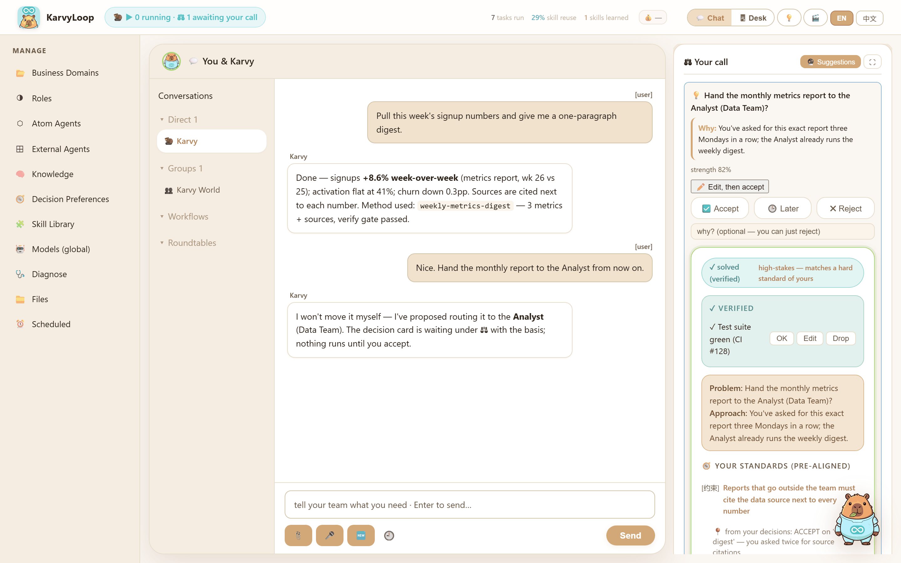
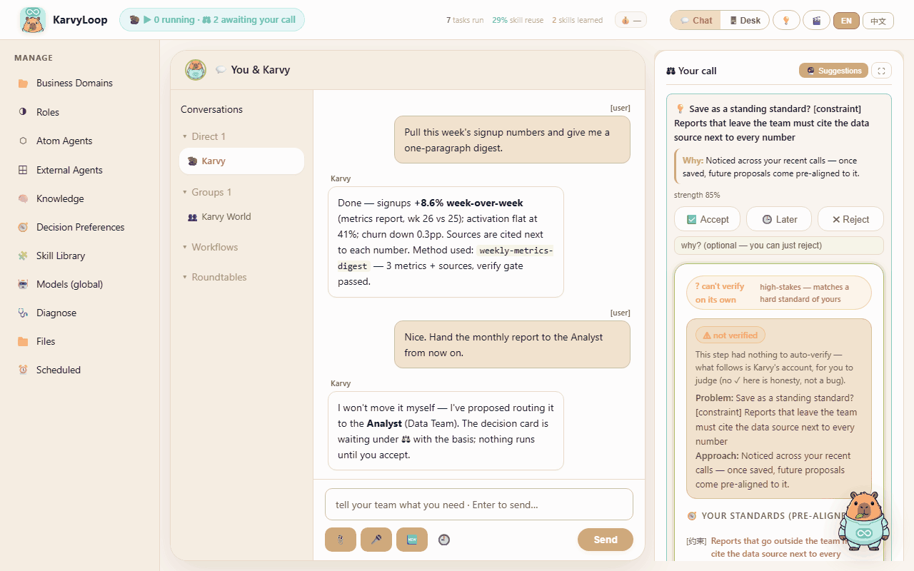
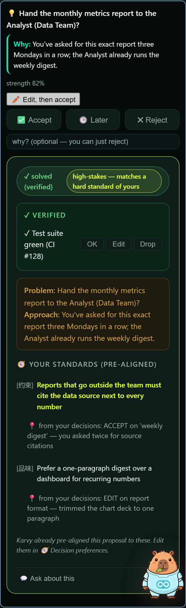
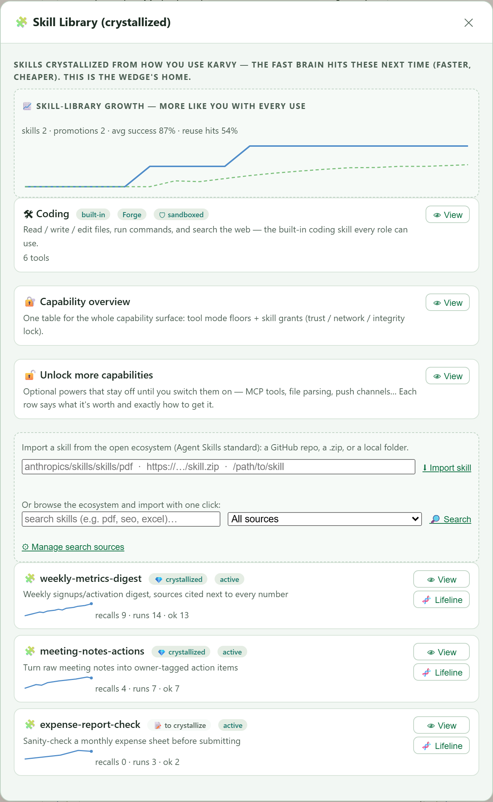
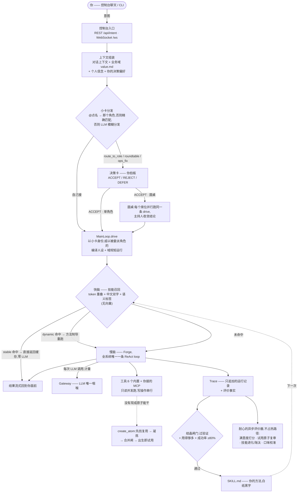
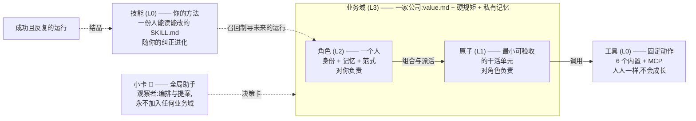

# KarvyLoop

> 🌐 **语言**: [English](README.md) · **中文(当前)**

**一个本地优先、loop 原生的 AI agent 运行时 —— 在你自己的机器上组建一支 AI agent 团队,替你跑活、自己验证产出,并把每一次使用都结晶成"你的"技能;而你始终是拍板的人。**

[](https://github.com/Caprista/KarvyLoop/actions/workflows/ci.yml)   

`AI agent` · `多智能体编排` · `LLM 运行时` · `loop engineering` · `本地优先` · `人在环 (H2A)` · `技能结晶` · `MCP` · `沙箱执行`

---

如果你真拿 AI 干活,你早就知道那笔隐形税:每周好几个小时保姆式盯它的产出(有调研说平均 6.4 小时)、对一个隔夜就忘了你的工具反复解释自己、活越委派审的越多。KarvyLoop 就是为了把这条曲线掰过来:**用得越久,它找你审批的次数越少 —— 且越来越准。**

## 这是什么?

KarvyLoop 是一个**跑在你自己机器上的 AI agent 运行时**。你组建一支团队:业务**域**(像一家公司 —— 比如"数据组")里配**角色**(有身份和偏好的 agent —— 比如"分析师"、"审核员"),每个角色由**原子**(一次只干一件可验收的小事的子 agent,比如"抓两份 CSV 做对比")组成;内置助手**小卡 🦫** 用大白话替你把它们编排起来。它替你跑重复的活、**自己验证产出**,并且每一次使用都**结晶成一个版本的_你_**:重复的任务变成**技能**(第三次让它做周报摘要时,它已经是一份写下来的方法,几分钱就能复用),你的选择变成**决策偏好**(摆在未来每次拍板旁边)。一条硬的**人在环**规则 —— **H2A**:AI 提议、*你*拍板 —— 意味着不点头就不动手:一张**决策卡**先出现("把月度报表交给分析师?"),你点接受,它才动。





*23 秒一圈:你拍板一张决策卡、⛶ 一瞥 2×2 看板、逛一圈你的团队上班的桌面(白天与黑夜)、再看一眼技能库的成长曲线 —— 越用越像你。*

别的 agent 框架大多是让*单次* LLM 调用更可靠;KarvyLoop 是 **loop 原生**:设计单元是整条自运转的循环 —— *发现工作 → 干 → 验证 → 复利 →(你拍板)→ 重复*。配套对话界面叫 **KarvyChat**。

> 多数 AI 工具把你架空、烧钱、还千人一面。KarvyLoop 把你留在驾驶座、用得起、把每一次都沉淀成抄不走的你。

### 如果你用过别的 agent 工具

- **AutoGen / CrewAI** 擅长让几个 agent 在*一次运行内*协作。KarvyLoop 的单元是跨运行、会重复的那条 loop:第 40 次月报应该比第 1 次更便宜、验得更严、更合你的意。
- **LangGraph** 给你任务图内部精确的控制流。KarvyLoop 关心的是任务周围和任务之间发生的事 —— 验证门、决策卡,以及每次运行留下的、会复利的沉淀(技能、偏好)。
- **Manus** 这类自主 agent 把"给个目标它自己干"跑在云上。KarvyLoop 把它跑在你自己机器上,用结构保证你始终是拍板的人,它学到的一切都落在归你所有的本地实例里。

一句话:它们优化单次调用或单次编排;KarvyLoop 优化整条会重复的 loop —— 并让重复产生复利。

## 特性

- 🤖 **在本地组一支 AI agent 团队。** 建**域**(公司)、配**角色**(agent)、由可复用**原子**(子 agent)组成 —— 一套操作系统式的 L0→L4 实体阶梯。还有一个**桌面视图**:你的 agent 坐在像素风工位上(卡皮巴拉小卡守在壁炉旁、拿着卡片来找你)—— 团队是一个"地方",不是一屏配置。
- 🧭 **大白话编排,你来批。** 跟小卡说*"去产品域找几个人分析下竞品"* —— 它拆出形状:单点委派、**圆桌**(几个角色并行思考再收敛)、**工作流**(多步管线)、或对系统本身的**运维**自检,并返回一张**决策卡**。不确认就不动手(**H2A**)。长**工作流可中断** —— 跑歪了半路取消,重启也不会悄悄把那个跑歪的版本复活。
- 🔁 **loop 原生设计。** 两条性质相反的 loop —— *执行 loop*(原子干活、自验;可全自动)和*决策 loop*(角色↔你;刻意**不**自动化)。架构里 role/atom 这一刀,切的就是这两条。
- 🧠 **一切复利成一个"你"。** 过了验证门的运行结晶成可复用**技能** —— 而且技能不再是孤零零的 Top-1 命中:一次命中会顺带带出至多两个**支持技能**,技能库开始生"利息",不只是攒条目。你的接受/拒绝/修改结晶成**决策偏好**,预对齐未来的提案;**角色**会沉淀自己那个域的经验(分析师越用越是"你的分析师",不只是全局变强);你的知识还会**自己消解矛盾** —— 比如你现在吃素了,去年那条"爱吃牛排"会被取代(留在历史里、但从召回里剔掉),而不是永远自相矛盾。代码可抄,**实例抄不走** —— 你的实例、你的数据。
- 📬 **决策来找你,不用你去查。** 待拍的卡挂在控制台;开了可选的**邮件通道**,卡会打包进你的邮箱,带签名的一键回批链接(任何 NAT 后都能用,不依赖任何第三方服务);**周报卡**汇总你的团队这周跑了什么、花了多少、学会了什么,每个数字可回溯。挂着的卡会显式变老,不会烂在角落。
- 🤫 **它开始学着"什么时候别打扰你"。** 小卡对你决策的预测命中率不只是照镜子:按决策的种类,一旦它足够久、足够准(Wilson 95% 置信下界 ≥0.90、样本 ≥35 例——统计门,不是连胜纪录),就会**主动提议**由它把这一类安静处理。这份"静默"要你**显式授予**(绝不自作主张,高危动作一律排除,只要错一次立刻收回)—— 于是它慢慢挣到资格,在那些它已经学会你会怎么拍的事上,不再打断你。
- 🛑 **你始终在驾驶座 —— 长时间无人值守也守得住。** **预算刹车**在网关这道咽喉上强制 token/成本硬上限:失控的后台工作流花到顶就**fail-stop**(你正等着的前台活永不被拦 —— 所以你敢把 key 交出去)。域的硬规矩(**deontic** *"绝不下单交易"*)是对**工具和命令本身的确定性硬闸**,不是一句你祈祷模型会听的 prompt。还有内置的 **doctor**(`karvyloop doctor --fix`):安全、确定的坏掉它自己修,并探活性(模型端点到底连不连得上?)—— 装坏了会告诉你*为什么*,而不是闷声失败。
- 🔍 **看得见"为什么",不只是"是什么"。** 你一边说,相关的技能和知识一边主动浮出来(纯本地匹配,零额外 LLM 调用);每个技能有**生命线时间轴**(结晶 → 修订 → 复用),"我的技能怎么变了"永远有答案。
- 📚 **个人知识库 + 认知图谱。** 喂它链接或笔记,它蒸馏成可检索的**知识点**并落到网状图谱(grep + 概念重叠,**无向量库**),控制台里能浏览。
- 🔌 **多 provider LLM 网关 + MCP。** 任意 Anthropic / OpenAI 兼容端点;唯一网关咽喉计每一个 token —— 还会**缓存每次调用的稳定前缀**(system + tools 尾块),重复运行时直接从 provider 缓存读回,把这部分 input 成本砍掉约 80–90%(越用越省)。接入 **MCP** server,其工具即达每个 agent —— **本地(stdio)或厂商托管的远程都行**(粘一个 streamable-HTTP URL + 可选 token,不用在本地跑任何进程)。
- 🔒 **安全是构造级的。** 每个任务带能力令牌;文件/网络/进程访问对照它放行;第三方技能在 **bubblewrap**(Linux)/ **Seatbelt**(macOS)沙箱里跑,且带**完整性锁**(被篡改的技能目录在索引和执行两道都被拒)。控制台拒绝跨源浏览器请求(HTTP + WebSocket 同源门),叠加跨设备访问令牌。技能面板的「**能力总览**」卡一张表审计全能力面。它低于 agent 的信任边界 —— 绕不过。
- 🏠 **本地优先、私密。** 跑在 `localhost`;你的数据在 `~/.karvyloop/`,绝不上传。**MIT** 许可;**按版本发布**,没你点一下绝不自升。

### 支持的平台

| 系统 | 状态 |
|------|------|
| **Linux** | ✅ 一等公民 —— 完整安全沙箱(bubblewrap)。 |
| **macOS** | ✅ 支持 —— 系统自带 Seatbelt 沙箱(`sandbox-exec`),与 Linux 同套 fail-closed 契约;比 Linux 新、更糙。 |
| **Windows** | ✅ 支持 —— 受限令牌沙箱(`WRITE_RESTRICTED` 令牌做写隔离 + 逐目录 ACL 白名单,Job Object 管资源上限)可用时就在里面跑技能脚本;探测不可用时(企业锁定策略 / 杀软干扰)优雅降级:第一方 workspace 读写/执行照常、第三方技能脚本 fail-closed。诚实边界:Windows 暂无免 admin 的网络门,需要联网的技能在此 **fail-close**(去 Linux/macOS 跑);读隔离放宽(同 macOS);定位是防误操作 + 一般不可信脚本,不是防蓄意逃逸。 |

KarvyLoop 是跨平台的用户态运行时(纯 Python,不吃 Linux 内核红利)。唯一与平台相关的就是沙箱:**Linux 用 bubblewrap,macOS 用系统自带的 `sandbox-exec`,Windows 用受限令牌 + Job Object 沙箱**;默认拒写 + 白名单 + 网络门契约一致(Linux/macOS 网络门完整,Windows 对联网 fail-close 而非假装隔离)。macOS 已在 Apple Silicon / macOS 26 上对抗式验证;Windows 写隔离 + 资源上限已在 Win11 Home 上对抗式验证。

> ⚠️ **早期、正在密集开发中。** KarvyLoop 还在 1.0 之前、跑得很快:很多功能尚未完整测试,毛刺在所难免 —— 我们提前开源,是想和大家一起把它磨锋利。**请多多包涵,Bug 反馈尤其珍贵。** 🙏

---

## 快速开始

**环境**:Python 3.11+。**安装命令各平台一样**(`pip install -e .`);只有沙箱隔离原语不同 —— **Linux 需装 `bubblewrap`**(如 `apt install bubblewrap`),**macOS 用系统自带的 `sandbox-exec`,无需安装**;**Windows 用系统自带的受限令牌 + Job Object 沙箱,无需额外装包**(需联网的技能在 Windows fail-close;沙箱初始化不了时降级为仅第一方、禁第三方技能脚本)。其余全跨平台。

```bash
# 1) 安装 —— 把 `karvyloop` 装上 PATH、隔离(在 PEP 668「externally managed」发行版上也安全)
curl -fsSL https://raw.githubusercontent.com/Caprista/KarvyLoop/main/scripts/install.sh | bash
#    Windows(PowerShell):  irm https://raw.githubusercontent.com/Caprista/KarvyLoop/main/scripts/install.ps1 | iex
#    (要对着 clone 开发?  pip install -e .  —— 但见下方「karvyloop 命令找不到?」)
#    Linux 还需沙箱:  sudo apt install bubblewrap
#    macOS 沙箱自带:  无需安装(sandbox-exec 系统自带)

# 2) 配置模型(密钥放在仓库之外)
mkdir -p ~/.karvyloop
$EDITOR ~/.karvyloop/config.yaml   # 见下方"最小配置"

# 3) 启动本地控制台(网页 UI)
karvyloop console --host 127.0.0.1 --port 8766
# 浏览器打开 http://127.0.0.1:8766
```

**最小 `~/.karvyloop/config.yaml`**(把 `${ANTHROPIC_KEY}` 换成环境变量或字面量密钥——**真实密钥永不入库**):

```yaml
lang: zh
models:
  providers:
    anthropic:
      base_url: https://api.anthropic.com
      auth_header: x-api-key
      messages_path: /v1/messages
      api_key: ${ANTHROPIC_KEY}
      models:
        - id: anthropic/claude
          name: Claude
          api: anthropic-messages
          context_window: 200000
          max_tokens: 8192
agents:
  defaults:
    model: anthropic/claude
embedding:
  model: anthropic/claude
```

> 模型也能在控制台里图形化管理(左导航 🤖 模型)。任何 Anthropic 兼容端点都能接;OpenAI 兼容端点用 `api: openai-completions`。
> 只想看 UI 不接模型?`karvyloop console --no-llm`(只读,不需密钥)。

## 头 5 分钟

整条 loop 一遍过 —— 每步大约一分钟:

1. **装好、接上模型**(见上方快速开始)。*你会看到:*控制台打开、当场验证 key 可用,小卡跟你打招呼。
2. **说一件小而具体的事**,在私聊里对小卡 —— 比如 *"列出我工作区里最大的 5 个文件"*。*你会看到:*它跑完、结果流式回来。这就是**执行 loop**。
3. **给它点可转交的活。** 左导航建一个域、配一个角色(30 秒),然后跟小卡说 *"把月度报表交给分析师做"*。*你会看到:*小卡不动手 —— 一张**决策卡**出现在 🤝,写着这是啥、凭什么。
4. **拍板。** 直接接受,或先改一句(*"……控制在 200 字以内"*)。*你会看到:*活跑起来了,你这一板进了 🗳 **最近拍板**。
5. **过后再来看。** *你会看到:*你改的那句已经变成标准、摆在下一张卡旁边;重复的活正在结晶成**技能**。你被问得更少、问得更准 —— 这正是重点。

想慢慢走一遍、多看点为什么?见下方[引导版头 15 分钟](#头-15-分钟引导版)。

### 可选功能(extras)

基础安装就能跑完整产品。少数能力需要额外装一个包——**缺了全都优雅降级**(小卡照常跑,只是少那一个功能;真去用时给清楚的"装 X"提示,**绝不崩**)。按需装:

| Extra | 安装 | 解锁 | 不装时 |
|---|---|---|---|
| **mcp** | `pip install -e ".[mcp]"`(+ `pip install uv` 装 `uvx`) | 接任意 [MCP](https://modelcontextprotocol.io) server —— 本地 stdio(`command`)**或厂商托管的远程(streamable HTTP,`url` + 可选 bearer token)**;工具注入给每个 agent(键带 `mcp_<server>_` 前缀) | MCP 工具不可用;用到时返回清楚的"装 mcp"报错 |
| **web** | `pip install -e ".[web]"` 再 `playwright install chromium` | 网页产物的**运行时**验收(`karvyloop verify-web`)——真把页面加载起来验 | 降级到只验语法;老实告诉你运行时没验过 |
| **redis** | `pip install -e ".[redis]"` | 跨进程 / 跨机的 agent 协作(Redis A2A transport) | 自动降级到 in-process transport——单进程够用 |
| **relay** | `pip install -e ".[relay]"` | 给"小卡信使中继"加端到端加密:用 `karvyloop console --relay` + `karvyloop relay-pair` 从任何地方够到你的控制台(中继本身 —— `karvyloop relay-serve` —— 无状态、盲转发,不需要额外装包) | `--relay` / `relay-pair` 报清楚的"pip install karvyloop[relay]"提示 |
| **files** | `pip install -e ".[files]"` | 附件真解析:PDF / Word(.docx)/ Excel(.xlsx)提取成文本,供文件面板预览和 agent 分析(CSV/纯文本无需额外装);损坏/伪造扩展名的文件明确拒收 —— 绝不吐二进制垃圾 | 预览/读取这些格式时返回清楚的 "pip install karvyloop[files]" 提示 |
| **asr** | `pip install -e ".[asr]"` | **本地音频转写**([faster-whisper](https://github.com/SYSTRAN/faster-whisper),MIT):会议录音/语音备忘(mp3/wav/m4a)在你自己机器上转成文字 —— 与 PDF 同一条附件产线,文件面板能预览、角色(如会议纪要)直接吃文字稿。首次使用才下载语音模型(默认 `small` ≈ 480MB,`KARVYLOOP_ASR_MODEL` 可换);CPU 就能跑,全程不上传 | 音频文件返回清楚的 "pip install karvyloop[asr]" 提示 —— 绝不编造转写 |
| **dev** | `pip install -e ".[dev]"` | 跑测试套件(`pytest`、`respx`…) | ——(只在开发/测试 KarvyLoop 时需要) |

可组合:`pip install -e ".[mcp,web]"`。这些都不卡核心 loop——聊天、业务域/角色、决策、技能、token 账本在基础安装上全都能用。

这张表不用背:console 里有一个**「解锁更多能力」**面板(技能库 → 🔓,诊断面和「第一个 10 分钟」旅程收官处也有入口),实时探测每项能力的状态——已就绪 / 未配置 / 缺依赖——并告诉你每项值什么、怎么打开,包括去哪找 MCP server([官方 registry](https://registry.modelcontextprotocol.io/),以及 [PulseMCP](https://www.pulsemcp.com/servers)、[Glama](https://glama.ai/mcp/servers) 这些社区目录站)。

## 头 15 分钟(引导版)

与[「头 5 分钟」](#头-5-分钟)是同一条 loop,放慢了走 —— 不用懂 agent:

1. **启动 + 接模型(约 5 分钟)。** `karvyloop console` → 配置页问你"AI 从哪来";选一个 provider,它给你"去拿 key(30 秒)"的链接,粘进去,它当场验证能不能用。(想本地跑?选本地选项,按安装指引来。)你的 key 在 `~/.karvyloop/config.yaml`,绝不进任何仓库。
2. **和小卡说话。** 在私聊里让它做点小而具体的事,它跑完返回 —— 这是**执行 loop**。
3. **组个团队。** 左导航 → 建一个业务**域**(像个公司),给它几个**角色**(比如域"数据组",角色"分析师"、"审核员")。
4. **把活交出去。** 回到和小卡的私聊,说一句*"把月度报表交给分析师做"*。小卡不越进域里——它**提议**转交,一张**决策卡**出现在 🤝。
5. **拍板。** 卡用你的语言说清"这是啥、凭什么";已核验区(✓/✗)和小卡的复述分开;你自己的标准预对齐在旁边。接受 / 改一条依据 / 拒绝 —— 你定。然后它进 🗳 **最近拍板**,供你回看。

   

6. **它会复利。** 你的接受/拒绝/修改结晶成**决策偏好**,预对齐未来的提案(你被问得更少、重复解释自己更少);重复的活结晶成**技能**,"快脑"直接复用——每次更便宜、更"你"。

   

---

## 为什么叫 "Loop 原生" —— 速览版

> 完整论述在 [docs/PHILOSOPHY.zh-CN.md](docs/PHILOSOPHY.zh-CN.md)。这里是骨架,一行一个观点。

- **行业在优化一次调用;我们在优化整条循环。** prompt → context → harness engineering,每一级都是让*单次* LLM 调用更可靠。KarvyLoop 的设计单元是会重复的 loop —— *发现 → 干 → 验证 → 复利 →(你拍板)→ 重复* —— 因为下周一你的报表还得再出一次。
- **loop 不是中性的。** 同一条 loop,让一个人复利成杠杆,却一次一个"接受"地把另一个人悄悄自动化出了他自己的工作。这里的一切设计,都是为了让你当 loop 的*工程师*,不滑成*旁观者*。
- **两条 loop,一刀切开:这件事担不担你的责?** *怎么抓数据做对比* → 执行 loop,狠狠自动化;*这份报表要不要以你的名义发出去* → 决策 loop,永不自动化。这就是 **H2A** 在结构上的含义。
- **不该有"那件事怎么样了?"。** 你一旦得主动去问,决策 loop 就已经塌了。卡住的活带着证据自己冒出来 —— *"试了三条路,卡在这里,需要你定这个"* —— 绝不静默挂掉。
- **无法明智行使的否决权只是摆设。** 更多的 AI 解释只会增加依赖,不管答案对不对(过度信任陷阱)。所以**决策卡**只把过了验证门的显示成 ✓,其余老实标"未核验",并把你自己以前的标准摆在这次拍板旁边。
- **两种结晶。** 运行复利成**技能** —— 存的是*方法*,绝不缓存答案(半年前的竞品清单原样回放是投毒;命中时拿新输入把方法重跑);你的接受/拒绝/修改复利成**决策偏好** —— *"绝不直接给客户发邮件"* 会预对齐未来每一个提案。
- **一个诚实的记分员。** 一条 append-only 的 **Trace** 记下一切;评价离热路径异步做;每一层由它对谁负责的那层来评 —— 你评角色,角色评原子。
- **镜像 vs 实例。** 代码开源可抄 —— 就是这个仓库;你在其上长出来的实例 —— 记忆、技能、决策风格 —— 抄不走。

想看完整论证、失败模式和每一行背后的依据?→ **[docs/PHILOSOPHY.zh-CN.md](docs/PHILOSOPHY.zh-CN.md)**

---

## 架构速览

**实体模型(操作系统式阶梯,与 `karvyloop/schemas/` 字段一一对应):**
- **L0 工具/技能** —— 无状态能力单元。一次性工具与结晶技能都在这层。
- **L1 原子** —— 最小"思考单元":能为它写验证门的单一职责 agent。这是**执行 loop**(可全自动)。
- **L2 角色** —— 原子 + 灵魂(身份/偏好)。角色↔人这条边界是**决策 loop**(不可自动化——价值复利之处)。
- **L3/L4 业务域/子域** —— 长期协作的"公司/部门",带共享价值观与护栏。

**运行时主干** —— 一个请求的流向:`控制台(FastAPI REST + WebSocket)→ MainLoop.drive → 快脑召回(命中=零 LLM)或 慢脑 Forge(ReAct)→ gateway(多 provider LLM)→ sandbox(bubblewrap)+ 能力令牌 → 流式回 UI`。gateway 是所有 LLM 调用的唯一咽喉,token 记账就在这一层做——记账绑在网关上(任何跟模型说话的路径都被计入),不是一个调用方可能忘掉的可选开关。

**安全是地基** —— 每个任务签发能力令牌;所有文件/网络/进程访问对照令牌放行;第三方技能脚本在沙箱里以最小授予运行(只限工作区,未经你显式授权无网络)。它低于 agent 的信任边界——绕不过。

### 运行全景——一个请求,从头到尾

下图每个框都是仓库里真实存在的机制(没有一个是"规划中"):



每个框的位置:入口 `karvyloop/console/`(`routes.py`、`ws.py`)· 分发 `karvyloop/karvy/fuzzy_dispatch.py` · 决策卡 `karvyloop/karvy/h2a.py` + `console/proposal_handlers.py` · drive `karvyloop/runtime/main_loop.py` · 召回 `karvyloop/crystallize/recall.py` · Forge/ReAct `karvyloop/coding/forge.py` → `karvyloop/atoms/executor.py` · 工具 `karvyloop/coding/tools/` · create_atom `karvyloop/atoms/self_create.py` · 结晶 + 异步评价 `karvyloop/crystallize/` · 试用复审 `karvyloop/atoms/provisional.py`。

**角色什么时候会造原子?** `create_atom` 是挂给运行中 agent 的**运行时工具**(它本身永远不是原子,所以永远不会出现在角色的原子列表里)。模型只在**没有任何现成原子能干这件事**时才调它。之后按序发生:**① 先找复用** —— 先搜公共原子池,搜到就直接复用,什么都不新建;**② 凝炼** —— 把能力描述凝成单一职责的规格,只准引用那 6 个真实工具(不许编造工具名;凝不出来就宁可空手失败,绝不写垃圾);**③ 合并闸** —— 更严的词面重叠检查 + 语义标签重叠检查,逮住近义重复就复用;**④ 出生即试用** —— 新原子带着 `provisional` 标记诞生。这次运行失败或你不认可结果,无引用的试用原子会被撤销;成功则组合进创建它的角色,之后周期性复审:被角色真实引用的转正,孤儿撤销。跨角色的近重复原子会以**合并提案**浮上来——你 ACCEPT 之后才先改引用再删除(`atoms/self_create.py`、`atoms/provisional.py`、`atoms/consolidate.py`)。

### 这几个概念怎么咬合



问责链是**你 ← 角色 ← 原子**:角色对你负责(由你的反馈裁),原子对角色负责(由客观结果裁)。工具人人相同、永不成长;技能只属于你、越用越厚。

### 内置工具——完整清单

内置工具就 6 个(`karvyloop/atoms/tool_catalog.py`——一个不多一个不少),再加你自己接的 MCP:

| 工具 | 干什么 | 护栏 |
|---|---|---|
| `run_command` | 跑一条 shell 命令 | 先解析分类再执行;危险模式直接拦;超长输出落盘,长任务转后台 |
| `read_file` | 带行号读文件 | 只读下限;记快照供后续写操作校验 |
| `write_file` | 原子化新建/覆盖文件 | 强制先读后写,读后文件被改过就中止 |
| `edit_file` | 精确字符串替换 | 先读后写;匹配必须存在且唯一 |
| `web_search` | 搜网(默认免 key;provider 可插拔) | 只读;超时封顶 |
| `web_fetch` | 抓取 URL 提取正文 | 只允许 HTTPS;大小和超时封顶 |
| `create_atom` | *仅运行时:*没有原子能干时造一个 | 出生即试用 + 合并闸 + 跑后复审(见上文) |
| `mcp_<server>_<tool>` | **你自己**配置的 MCP 服务器工具 | 工作区写下限;强制命名空间,冒充不了内置工具 |

每次调用都对照任务的能力令牌校验(`karvyloop/capability/policy.py`):只读任务写不了东西,**不在策略表里的工具默认最严模式**——等于被拒,直到有人有意识地给它定下限。

### 怎么增加

| 想加… | 怎么加 | 入口 |
|---|---|---|
| **角色** | 实例化域模板、手动新建,或导入现有 agent——导入会被 LLM **拆解**成角色 + 可复用原子,不是压成一个文件 | 控制台 → 业务域(`POST /api/domain/templates/instantiate`、`/api/role/create`、`/api/agent/import`) |
| **原子** | 通常不用你动手——角色需要时经 `create_atom` 自造;也可以手动建,或随 agent 导入进来;跨角色近重复会以合并提案浮上来等你确认 | 控制台 → 原子(`POST /api/atom/create`、`/api/atoms/consolidate/*`) |
| **技能** | 用出来的(默认路径:自然结晶),或导入 Agent Skills 开放标准的 `SKILL.md` 文件夹 / zip / git 仓——导入的一律标 untrusted、哈希锁定、进沙箱 | 控制台 → 技能(`POST /api/skill/import`、`/api/skill/sources`) |
| **工具** | 接 MCP 服务器:选一键预设(filesystem、fetch、github、memory、time、sqlite),**粘一个托管 server 的 URL + 可选 token**(streamable HTTP;token 只进 config.yaml,绝不回显或落日志),或在 `~/.karvyloop/config.yaml` 的 `mcp.servers` 里自己加;内置工具是代码——欢迎 PR | 控制台 → 模型 → MCP(`GET /api/mcp/presets`、`POST /api/mcp/preset/apply`、`POST /api/mcp/server/add`) |

完整细节请读源码——代码有注释,下面的地图告诉你去哪看。

### 决策审计流水

你的每次拍板(ACCEPT / REJECT / DEFER,以及显式撤回偏好 REVOKE)都记进一份**只追加、落盘**的流水(`~/.karvyloop/decision_log.json`,留存上限 5000 条)——因为在一个替你行动的系统里,**哪些是你拍的**必须答得出来。两个只读端点暴露它:

- `GET /api/decisions/recent?limit=N` —— 🗳「最近拍板」的 UI 回看窗(newest-first,≤50)。
- `GET /api/decisions/audit?since=<ts>&until=<ts>&decision=<ACCEPT|REJECT|DEFER|REVOKE>&limit=<N>` —— **给外部审计 / 合规用**:按时间窗 + 决定类型查完整留存流水。每条带 `ts, decision, summary, reason, kind, domain, role, proposal_id`;响应含 `total`(留存条数,看完整性)。把外部审计工具指向这个端点,或直接读那个 JSON 文件。

### 仓库结构

```
README.md / README.zh-CN.md   ← 你在这(英 / 中)
LICENSE                       ← MIT
pyproject.toml                ← 安装 / 构建
karvyloop/                    ← 全部源码
  schemas/        数据契约(类型的唯一来源)
  gateway/        LLM 网关 + 模型注册表(多 provider;密钥只在这)
  context/        token/上下文治理(压缩、预算、断路器)
  atoms/          L1 原子运行时:全系统复用的那一条 ReAct loop
  coding/         Forge 编码执行器(委派给 atoms,不另起循环)
  capability/ sandbox/ platform/   安全:能力令牌 + bubblewrap 沙箱
  registry/       工具/技能注册表 + 第三方技能导入/沙箱执行
  crystallize/    ⭐ 楔子:技能结晶 + 决策接口结晶
  system_skills/  包内只读的系统技能/原子(随产品发布;清数据动不到)
  system_residents/  包内只读的原住民镜像(📁 文件管家;入住=你 ACCEPT 引荐卡后的一次普通角色实例化)
  cognition/      Belief / Pursuit / Trace + 激活扩散网状召回(图,无向量库)
  domain/ a2a/ karvy/   协作:业务域 / A2A 协议 / 小卡
  roles/ paradigm/ wizard/ adapter/   身份与范式层
  console/        本地网页控制台(FastAPI REST + WebSocket + 静态 SPA)
  runtime/ workbench/ cli/   核心循环(快慢脑)+ 终端 TUI + CLI
  i18n/           中英双语表现层
tests/                        ← pytest 测试套件(也是最好的用法示例)
```

---

## 升级

KarvyLoop **按版本发布**([CHANGELOG](CHANGELOG.md)),有新版会**提示你**——但**绝不自己升级**。检测 → 提示 → *你*拍板。"绝不自己升级"是说系统不自作主张——不是说你得一直敲命令:你**一点**,它就把整套替你跑完。

- **怎么知道有新版**:控制台在有新版时显示一条**可关掉**的横幅;或随时跑 `karvyloop update`。(只是对 GitHub Releases 做一次纯版本查询——**零遥测、不发任何数据**;用 `KARVYLOOP_NO_UPDATE_CHECK=1` 可关掉。)
- **一键升级**:横幅上有个**升级**按钮——点一下,控制台自己把整条流程跑完(**停 → 装 → 起**)并重连页面,**不用敲命令**。(只限本机、防 CSRF、单实例;升不升仍是*你*定,只是省了命令。)
- **或者手动**:从 clone 装的 → `git pull && pip install -e .`;从 PyPI(将来发布后)→ `pip install -U karvyloop`。横幅也会按你的安装方式显示对的命令。
- **你的数据不丢**:你长出来的一切都在 `~/.karvyloop/`(config、beliefs、skills、角色/原子、决策流水)——在仓库之外——跨版本存活。破坏性的数据变更必随附迁移,并在发布说明里明确标出。
- **打包带走**:`karvyloop export` 把整个实例(技能、知识、偏好、历史)打成一个可携带压缩包——API key 刻意留在原机;新机器上解进 `~/.karvyloop` 就是回家。
- **一条命令的回程**:`karvyloop import <包>` 替你解回 `~/.karvyloop`——路径安全、绝不碰本机 `config.yaml`、已有实例默认拒绝覆盖(`--force` 才合并,`--dry-run` 先看清单)。

## 跑测试

```bash
pip install -e ".[dev]"      # 装 pytest / pytest-asyncio / respx / psutil
pytest -q                    # 全量,不需要任何 flag
```

测试套件是**自洽的**:不依赖任何未随仓发布的文档;可选基建(如 `mcp` 包、redis、Linux+bubblewrap)**自动跳过**而非报错。预期约 **1880+ passed / 十几个 skipped**。想全跑:Linux 上 `pip install -e .`(把 `karvyloop` 命令装进 PATH)、`pip install mcp`、装 `bubblewrap` 和 `redis`。

> 有一条元守卫测试(`tests/test_suite_self_contained.py`)禁止任何测试读取未发布的文档,所以"只有代码也能跑绿"是**制度**,不是侥幸。

## 前后端

经典分离:后端是 FastAPI(`/api/*` REST + 一条 `/ws` WebSocket,`/docs` 自带 OpenAPI);前端是 `karvyloop/console/static/` 下的纯静态 SPA,只通过 `fetch` + WebSocket 通信。换任意框架重写前端,照同一套契约做,后端零改动。

**构建(可选——只有改前端时才需要)。** console 原样服务 `karvyloop/console/static/`,且构建产物已入库,所以普通安装**不需要 Node**。SPA 正在**增量迁移到 TypeScript + Vite**(纯 TS,不上运行时框架)——源在 `karvyloop/console/frontend/`,每个迁好的模块构建成 `static/` 下的固定名 bundle,保持同一套 `window.Karvy*` 全局契约(未迁的 `.js` 照常用)。改了 TS 后重建:

```bash
cd karvyloop/console/frontend
npm install
npm run verify   # 类型检查 + 构建 → ../static + 运行时 smoke(jsdom)
```

> **访问与鉴权。** 默认 console 只绑 `localhost`(仅本机)。本机(loopback)请求免密;一旦你绑到局域网(`--host 0.0.0.0`)好从别的设备访问,**非本机地址必须带 token** —— token 每次启动新生成,在这台机器上跑 `karvyloop url` 获取带 token 的链接。(局域网**不是**信任边界 —— 否则公司/家里同网段任何人都能访问。)放到公网仍需你自己在前面加 TLS + 反向代理鉴权。
>
> **出门在外怎么拍板?(远程决策。)** token 链接只在你的局域网内有效 —— KarvyLoop 刻意不开任何公网端口。出门拍板用内置的**邮件决策闭环**:配好 `channels.email`(见下),待拍的决策卡会打包成摘要发进你的邮箱;每张卡带预填好的回批链接(`同意 / 拒绝 / 搁置`,附单次有效、限时的签名码),console 出站轮询你的收件箱 —— **全程只有出站连接**,任何 NAT 后面都能用,**不用端口转发、不用穿透、不依赖任何第三方服务**;任何邮箱都行。高危卡(如文件系统授权)刻意只通知不可回批 —— 那些回控制台确认。想在外面用完整控制台,私有组网(如 [Tailscale](https://tailscale.com) 或纯 WireGuard,你自己设备间端到端加密)也可以。**不建议**:在路由器上直接转发 8766 端口 —— console 的 token 鉴权不是为独自面对公网设计的。
>
> **更习惯手机推送?(webhook 通道。)** 邮件之外还有一条通用的**出站 webhook 通道**:待拍的决策卡打包成一条推送(标题、每卡摘要、价值等级、回链 console 的链接)发到你配置的任意 HTTP 端点。一条通道通吃主流承接方 —— 内置 `ntfy`、`bark`、`slack`(Slack 兼容 incoming webhook:Discord 的 `/slack` 端点、Mattermost 等)和 `generic`(完整 JSON)四个 preset;其他承接方(如飞书机器人)用自定义 `body_template`。这条通道也能把你的拍板带回来:把 `reply_url` 配成一个可轮询的回执源(如私有 ntfy topic 的 `/json?poll=1` 端点),手机上回一条 `ACCEPT <码>`(或 `REJECT` / `DEFER`)即拍板 —— 与邮件通道同一套单次有效、限时的签名码、同一条决策落地路;只认严格格式(回执源里的其他内容一律当数据、绝不当指令),高危卡照旧只通知不可回批;不配 `reply_url` 就还是纯出站。姿态与邮件一致:全程只有出站连接(console 主动**轮询**回执源 —— 依旧不开任何监听端口),任何 NAT 后面都能用。webhook URL 和 headers 常内嵌 token —— 只存在 `~/.karvyloop/config.yaml`(仓库外),**绝不进日志**(日志里只留目标的 scheme+host)。
>
> ```yaml
> # ~/.karvyloop/config.yaml —— 可选;不配 = 功能完全关闭
> channels:
>   email:
>     enabled: true
>     to: you@example.com
>     smtp: { host: smtp.example.com, port: 465, user: bot@example.com, password: ${MAIL_APP_PASSWORD} }
>     imap: { host: imap.example.com, port: 993, user: bot@example.com, password: ${MAIL_APP_PASSWORD} }
>   webhook:
>     enabled: true
>     url: https://ntfy.sh/your-private-topic   # 可能内嵌 token/topic/key —— 绝不进日志
>     preset: ntfy          # generic | ntfy | bark | slack;其他承接方用 body_template 自定义
>     # headers: { Authorization: "Bearer ..." }   # 可选,覆盖 preset 的同名头
>     # min_interval_s: 3600                       # 推送节流(与邮件 digest 同语义)
>     # reply_url: https://ntfy.sh/your-private-reply-topic/json?poll=1   # 可选:入站回批(轮询拉取;不配 = 纯出站)
> ```
>
> **`karvyloop` 命令找不到?** `pip install` 会把 `karvyloop` 命令装进你那个 Python 的 `bin`/`Scripts` 目录 —— 系统 Python 通常已在 `PATH` 上,但**若你装进了没激活的 venv、或 `pip install --user` 而 `~/.local/bin` 不在 `PATH`(不少发行版如此),就找不到**。两个办法:**(a)** 用**装它时那个 Python** 跑 `python -m karvyloop url`,不依赖 `PATH`,永远可用;**(b)** 想要干净的全局 `karvyloop` 命令,用 **pipx**:`pipx install karvyloop && pipx ensurepath`(pipx 隔离安装并把它加进 `PATH`)。pip 自己从不改你的 shell `PATH`。

## 文档

- **[快速上手](docs/QUICKSTART.zh-CN.md)** —— 从安装到第一个结晶技能,大约 10 分钟(需要什么、各平台的诚实边界,都写明)。
- **[架构](docs/ARCHITECTURE.zh-CN.md)** —— 它怎么运转:双循环、L0–L4 实体阶梯、结晶两道关、H2A 决策卡、挣来的静音、Trace、网关、三平台沙箱 —— 带代码里的真实阈值。
- **[概念](docs/CONCEPTS.zh-CN.md)** —— 一页纸词汇表:角色、原子、技能、域、决策卡、镜像 vs 实例……每个都给*为什么*,不只*是什么*。
- **[理念](docs/PHILOSOPHY.zh-CN.md)** —— 为什么非要"loop 原生":论证、失败模式、依据。

## 贡献

欢迎 PR —— 完整贡献流程见 **[CONTRIBUTING.md](CONTRIBUTING.md)**(clone → `pip install -e ".[dev]"` → `pytest` → `ruff check`)。简言之:每个 PR 都会跑 [CI](https://github.com/Caprista/KarvyLoop/actions/workflows/ci.yml)(Ubuntu,Python 3.11 + 3.12),必须全绿——即 `ruff check`(lint 门,不自动改码)加完整测试套件。用户可见字符串走双语 i18n 表。真实 API key 永不入库——只放 `~/.karvyloop/config.yaml`(仓库外);测试 fixture 用明显的假 key。

## 许可证

[MIT](LICENSE)。代码开源;你的实例(你长出来的数据与技能)归你。

---

🦫 **小卡** 在你驾驶座旁等你。
