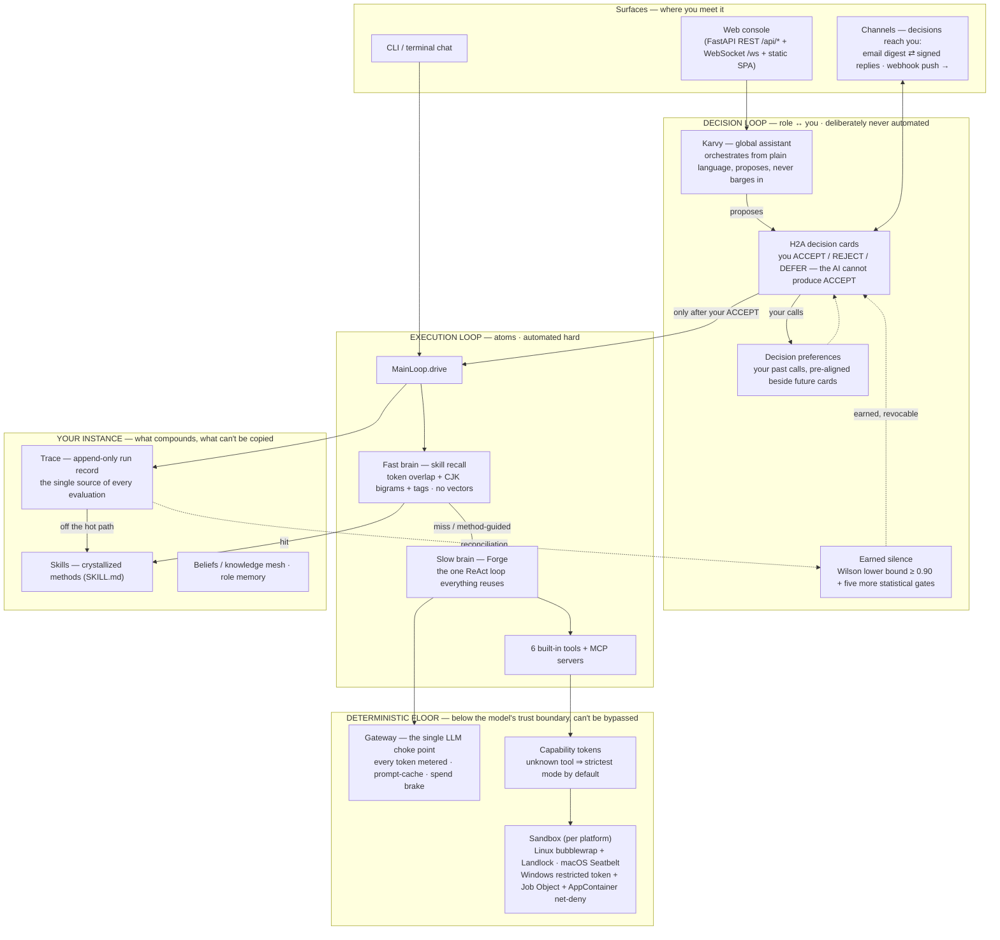

# Architecture — how KarvyLoop actually works

> 🌐 **Language**: **English (current)** · [中文](ARCHITECTURE.zh-CN.md)

This document is for people who want to understand the system before (or instead of) reading the source: contributors, evaluators, and the curious. Everything described here is a real mechanism in this repo — where a number appears, it's the number in the code, and the module that owns it is named so you can check.

New to the vocabulary? Read [CONCEPTS.md](CONCEPTS.md) first (5 minutes). Want the *why* behind the design? [PHILOSOPHY.md](PHILOSOPHY.md).

---

## The whole system on one page

Two properties make this more than a block diagram:

1. **The two loops have opposite natures on purpose.** The execution loop (bottom) is automated as hard as possible; the decision loop (top) is *structurally* not automatable — the AI can propose, predict, and pre-fill, but the ACCEPT itself only ever comes from you.
2. **The floor is deterministic.** Gateway metering, capability checks and the sandbox are not prompts the model is asked to respect — they are code the model's output passes through. A domain rule like *"never place a trade"* is enforced as a gate on tools and commands, not as a hopeful system-prompt line.

---

## The two loops

Every piece of work is split by one question: **does it carry your responsibility?**

| | Execution loop | Decision loop |
|---|---|---|
| Unit | **Atom** (L1) — single responsibility, verifiable | **Role** (L2) ↔ **you** |
| Question it answers | *how* to do the job | *whether* it goes out under your name |
| Automation | as full as possible — self-verifies, retries, replans | deliberately never — H2A by construction |
| Judged by | objective outcomes (verify gates, success rate) | your feedback (accept / reject / edit) |
| Failure handling | the owning role replans; infra-dead failures fail loud | blocked work surfaces itself with evidence — you never have to ask *"how's it going?"* |

The chain of accountability is **you ← role ← atom**: a role answers to you and is judged by your feedback; an atom answers to its role and is judged by objective outcomes. Signals are never mixed across layers — your thumbs-up doesn't grade an atom, and an atom's green check doesn't earn a role your trust.

## The entity ladder (L0–L4)

An OS-like ladder, mirrored field-for-field in `karvyloop/schemas/`:

| Level | Entity | What it is | Why it exists |
|---|---|---|---|
| **L0** | **Tool** | fixed action (6 built-ins + MCP) — same for every user, never grows | the floor of what can physically happen |
| **L0** | **Skill** | *your* crystallized method (`SKILL.md`) — grows with use | the part that compounds and can't be copied |
| **L1** | **Atom** | smallest thinking unit; single-responsibility so a verify gate can be written for it | if you can't check it, you can't automate it honestly |
| **L2** | **Role** | atoms + a soul: identity, preferences, domain-scoped memory | the interface that carries responsibility toward you |
| **L3/L4** | **Domain / Sub-domain** | a long-lived "company/department": shared values, hard rules, private memory | collaboration needs a boundary — and rules that outlive any one task |

Tools and skills share L0 deliberately: both are stateless capability units, but tools are identical for everyone while skills are the residue of *your* use. That asymmetry is the product thesis in one line.

Atoms are usually **not** hand-written. When no existing atom fits, the running agent calls a `create_atom` runtime tool which (1) searches the shared pool first — reuse beats creation; (2) synthesizes a single-responsibility spec that may only reference real tools (it cannot invent tool names — if nothing coherent condenses it fails empty rather than write garbage); (3) passes lexical + semantic-tag merge gates to catch near-duplicates; (4) is born `provisional` — removed if the run fails or you reject it, confirmed by periodic review if roles actually use it (`karvyloop/atoms/self_create.py`, `provisional.py`, `consolidate.py`).

## One request, end to end

`console → MainLoop.drive → fast brain (skill recall) → hit? answer/guide : slow brain (Forge ReAct) → gateway → tools in sandbox → result streams back → Trace records everything → crystallization gates run off the hot path`

The details that matter:

- **Recall is local and cheap** (`crystallize/recall.py`): token overlap + CJK bigrams + LLM-assigned semantic tags (assigned once at creation) — **no vector database, no embeddings**. A matched skill can bring along at most 2 *supporting* skills, each of which must independently overlap the current intent and add novel semantic units — "supports" that merely repeat the main hit are dropped.
- **Stable vs dynamic** (`runtime/main_loop.py`): a skill marked `stable` (rare, semantically reproducible) replays its cached body — the true zero-LLM fast path. Everything else is `dynamic` (the default): a hit **never replays the old answer** (a six-month-old competitor list replayed today is poison) — the stored *method* guides a fresh run on current inputs.
- **One ReAct loop.** Forge (`coding/forge.py` → `atoms/executor.py`) is the only reasoning loop in the system; every agent, role, and atom reuses it. Read-tools run concurrently; write-tools serialize.

## Crystallization — use becomes a method

The wedge of the whole product (`karvyloop/crystallize/`). Repeated, verified work is promoted into a readable `SKILL.md` — **the method, never the cached answer**.

Promotion is **two gates in strict order** (`crystallize.py`):

1. **Gate 1 — eligibility**: the task signature has a **verify gate** and at least one *verified* success. No checkable definition of success → not eligible, ever. This kills "it seemed to work once" skills at the root.
2. **Gate 2 — value**: usage score ≥ **3.0** (usage count decayed with a **7-day half-life** — recency matters), success rate ≥ **0.8**, and the task is either **generalized** (≥ 2 distinct parameter variants — it's a *method*, not one memorized invocation) or **high-frequency** (≥ 5 uses). A satisfaction floor (≥ 0.45 over the most recent scored samples, judged only once ≥ 3 samples exist) keeps work that users demonstrably disliked from promoting on volume alone.

Every threshold is a knob, not a truth — tunable in `config.yaml` (`crystallize.*`) without touching code.

After birth, a skill keeps living:

- **Revision**: corrections flow back into the method — small edits land automatically with a changelog entry inside `SKILL.md`; big rewrites raise a decision card first.
- **Eviction**: score < **0.5** and unused > **30 days** → archived (recoverable), so the library reflects who you are *now*.
- **The growth curve** you see in the console is a read-only replay of Trace — same scoring function as production, no separate bookkeeping to drift out of sync.

The second crystallization is quieter: your ACCEPT / REJECT / edit patterns condense into **decision preferences** (`crystallize/decision_pref.py`) that are shown beside future cards — you re-explain yourself less, and a proposal that would violate an established preference is flagged before you ever see it mis-run.

## H2A — the human decides

`karvyloop/karvy/h2a.py` + `console/proposal_handlers.py`. The core invariant, enforced in code and tests:

> **The AI never produces an ACCEPT.** Decisions are `ACCEPT / REJECT / DEFER`, and the only source of `ACCEPT` is you (console click, or a signed email reply — see Channels).

What arrives is a **decision card**: what's proposed, on what basis, with the **gate-verified region marked ✓/✗ separately from the model's narration** — the card honestly says "not verified" where nothing checked it, because a veto you can't exercise intelligently is theater. Your own crystallized standards are pre-aligned beside the call.

Every decision is appended to an on-disk audit log (`~/.karvyloop/decision_log.json`, last **5000** entries retained) with two read-only endpoints (`/api/decisions/recent`, `/api/decisions/audit`) — in a system that acts on your behalf, *which calls were yours* has to be answerable.

## Earned silence — learning when *not* to ask

The counterweight to H2A (`karvyloop/karvy/silence.py`): approval fatigue is real, so per *bucket* of decision kind, Karvy can **earn** the right to handle predictions quietly — under statistical gates chosen to be hard to game:

1. **Irreversible actions never qualify.** Sending, deleting, paying, production writes — excluded at both the kind level and per-card payload level, no matter how good the track record. High-risk kinds (filesystem grants, the silence-grant card itself, …) are hard-excluded too.
2. **The bar is a Wilson 95% lower bound ≥ 0.90**, not a raw hit-rate. (A raw "18 of 20 = 90%" has a Wilson lower bound of ~0.70 — it proves nothing. Even a *perfect* record needs n ≥ 35 to clear the bar.)
3. **Both directions must pass separately** — the ACCEPT side must clear 0.90 on its own, and the REJECT side needs ≥ 2 correct calls *and* a lower bound ≥ 0.50 (95% confidence of beating a coin) — because users approve ~93% of cards, so a zero-intelligence "always predict ACCEPT" strategy would sail past any blended gate.
4. **Evaluation is batched** (every 25 new reconciled samples per bucket), so the system can't peek after every sample and cash in a lucky streak.
5. **15% of cards in a silenced bucket still reach you, unlabeled** — unannounced audits, the only measure shown to counter automation complacency. **Grants expire after 30 days**; renewal is itself a decision card carrying the month's ledger and 5 risk-weighted samples for you to re-inspect.
6. **Blast-radius caps that don't trust track records**: ≥ 10 silenced actions in 24h per bucket → back to human; execution-type kinds whose recent average cost exceeds 30k tokens → back to human.

And the standing rules above all six: granting, renewal and revocation always go through H2A; a single wrong prediction or a reversal revokes immediately; every silenced action leaves a full audit trail; any failure anywhere in the chain falls back to *ask the human*.

## Trace — one honest scorekeeper

`karvyloop/cognition/trace.py` (+ sqlite persistence with WAL). An **append-only** record of every run: task events, tool calls, verification outcomes, evaluation facts.

Two disciplines follow from it:

- **Single source of evaluation.** Anything that judges anything — crystallization gates, satisfaction scoring, provisional-atom review, skill improve/evict, taste calibration, the growth curve — is *derived from Trace*, never computed ad-hoc on the execution path. One ledger, no parallel books to disagree.
- **Run/eval separation.** The hot path only runs and records. All judging happens in patient async evaluators, off the hot path — execution stays fast and cheap; learning takes its time.

`karvyloop replay <task_id>` prints a task's full trace as NDJSON.

## Gateway — the single LLM choke point

`karvyloop/gateway/`. Every LLM call in the system — every agent, every role, Forge, background evaluators — goes through one `complete()`:

- **Multi-provider by config, not code**: `anthropic-messages` and `openai-completions` API shapes; presets for Anthropic, OpenAI, DeepSeek, Kimi/Moonshot, OpenRouter, Ollama (local); any compatible endpoint runs with `base_url` + key (+ optional `extra_headers`).
- **Token metering lives here** — on the choke point itself, so any path that talks to a model is counted; it is not an optional switch a caller could forget. Usage is bucketed by time and attributed by source, so *when* it burns and *who* burns it are both answerable.
- **Prompt caching**: the stable prefix of each call (system tail + tools tail) is cache-marked, so repeated runs read it from provider cache — that slice of input cost drops by roughly 80–90% on cache-marking providers (OpenAI-style providers auto-cache; hits are recorded in the ledger either way).
- **Spend brake** (`llm/spend_budget.py`, checked in the gateway): at 75% / 90% of a registered budget you get a reminder card; at 100%, *background* work fail-stops loudly. Foreground work you're actively waiting on is never blocked — the brake is for runaway unattended loops, not for you.

## Capability tokens & the sandbox

Two layers below the agent's trust boundary:

**Capability tokens** (`karvyloop/capability/policy.py`): every task carries one; every tool call is checked against it. Read-only tasks can't write. A tool *not* in the policy table defaults to the **strictest** mode — effectively denied until someone consciously grants it a floor. MCP tools get a workspace-write floor and are namespaced (`mcp_<server>_<tool>`) so they can never shadow built-ins.

**The sandbox** (`karvyloop/sandbox/selector.py` picks per platform; the contract is default-deny-write + workspace whitelist + network gate):

| Platform | Mechanism | Notes |
|---|---|---|
| **Linux** | **bubblewrap**, wrapped with **Landlock** when the kernel supports it | first-class; full network gate |
| **macOS** | built-in **Seatbelt** (`sandbox-exec`) | same fail-closed contract; read isolation relaxed (v1) |
| **Windows** | **restricted token** (`WRITE_RESTRICTED`) for write isolation + **Job Object** for resource caps (2 GiB memory, 64-process cap, kill-on-close) + **AppContainer (LowBox)** token for a kernel-level default network deny — admin-free, enforced by Windows' built-in WFP rules | skills that *request* network fail-close (allow-listing specific hosts would need admin); if AppContainer can't initialize, the fallback is honestly labeled as not kernel-enforced |
| anywhere the mechanism is missing | **Stub sandbox: fail-closed** | third-party code is *refused*, never silently run unsandboxed |

On Windows, if even the restricted-token sandbox can't initialize (locked-down policy, AV interference), a **degraded mode** keeps first-party workspace read/write/exec working and fail-closes third-party skill scripts. Honest scope, stated in the code itself: this defends against mistakes and ordinary untrusted scripts, not a determined escape artist.

## Channels — decisions reach you

You shouldn't have to sit at the console to stay the decider (`karvyloop/channels/`):

- **Email** (`email_channel.py`) — the full round trip: pending cards go out as an SMTP digest; each card carries pre-filled reply links with a **single-use, time-limited HMAC-signed code**; the console polls IMAP for replies. Outbound connections only — works behind any NAT, no port forwarding, no third-party relay, any mailbox. Parsing is strict-format-only (free text is never interpreted as a decision); high-risk cards are notify-only by design — those you confirm back at the console, and the poller rejects them a second time as belt-and-braces.
- **Webhook** (`webhook_channel.py`) — outbound push of the pending digest to any HTTP endpoint; presets for `ntfy`, `bark`, `slack`-compatible receivers plus `generic` JSON and a custom `body_template`. Deliberately outbound-only in v1: the notification carries the link; deciding happens back at the console.
- Both share one credential discipline: secrets live only in `~/.karvyloop/config.yaml`, are never logged (log lines keep scheme+host at most), and digests carry card summaries, never full payloads.

## Where the code lives

| Area | Path |
|---|---|
| Data contracts (single source of types) | `karvyloop/schemas/` |
| LLM gateway, providers, presets, metering | `karvyloop/gateway/` |
| Atom runtime — the one ReAct loop | `karvyloop/atoms/` |
| Forge coding executor | `karvyloop/coding/` |
| Crystallization: skills, preferences, recall, curve, eviction | `karvyloop/crystallize/` |
| Trace, beliefs, knowledge mesh | `karvyloop/cognition/` |
| Karvy, H2A, earned silence | `karvyloop/karvy/` |
| Capability tokens / sandbox / platform backends | `karvyloop/capability/` `sandbox/` `platform/` |
| Domains, roles, A2A collaboration | `karvyloop/domain/` `roles/` `a2a/` |
| Web console (FastAPI + static SPA) | `karvyloop/console/` |
| Email / webhook channels | `karvyloop/channels/` |
| Main loop (fast/slow brain), CLI, TUI | `karvyloop/runtime/` `cli/` `workbench/` |

The test suite (`tests/`) doubles as the best set of usage examples, and CI requires it green on every PR.
