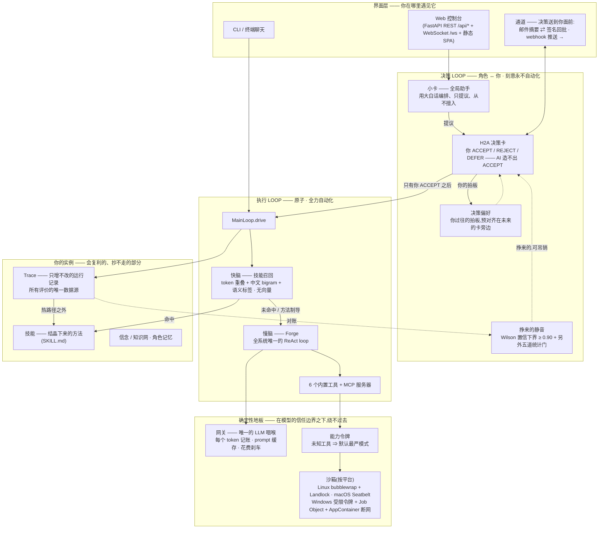

# 架构 —— KarvyLoop 到底是怎么运转的

> 🌐 **语言**: [English](ARCHITECTURE.md) · **中文(当前)**

这份文档写给想在读源码之前(或替代读源码)理解这个系统的人:贡献者、评估者、好奇的人。这里描述的每一样都是仓库里真实存在的机制 —— 凡出现数字,就是代码里的数字,并且点名了它所在的模块,方便你去核对。

对词汇陌生?先读 [CONCEPTS.zh-CN.md](CONCEPTS.zh-CN.md)(5 分钟)。想知道设计背后的*为什么*?看 [PHILOSOPHY.zh-CN.md](PHILOSOPHY.zh-CN.md)。

---

## 一页看全系统

让它不只是一张框图的,是两条性质:

1. **两条 loop 的性质刻意相反。** 执行 loop(下方)被尽全力自动化;决策 loop(上方)在*结构上*就不可自动化 —— AI 可以提议、预测、预填,但 ACCEPT 本身永远只能来自你。
2. **地板是确定性的。** 网关记账、能力检查、沙箱,都不是"拜托模型遵守"的提示词 —— 而是模型输出必须流经的代码。域规则如"绝不下单交易"是对工具和命令本身的闸门,不是一行寄希望于模型服从的 system prompt。

---

## 两条 loop

每一件工作都被一个问题切开:**它担不担你的责任?**

| | 执行 loop | 决策 loop |
|---|---|---|
| 单元 | **原子**(L1)—— 单一职责、可验收 | **角色**(L2)↔ **你** |
| 回答的问题 | 这活儿*怎么*干 | 这事*要不要*以你的名义发出去 |
| 自动化 | 尽全力 —— 自我验证、重试、重规划 | 刻意永不 —— H2A 是结构保证 |
| 由谁评判 | 客观结果(验证门、成功率) | 你的反馈(接受 / 拒绝 / 修改) |
| 失败处理 | 所属角色重规划;基础设施死亡则大声失败 | 卡住的工作带证据自己冒出来 —— 你永远不必去问"怎么样了?" |

问责链是 **你 ← 角色 ← 原子**:角色对你负责,由你的反馈评判;原子对角色负责,由客观结果评判。信号绝不跨层混用 —— 你的点赞不给原子打分,原子的绿勾也换不来角色对你的信用。

## 实体阶梯(L0–L4)

一个类似操作系统的阶梯,与 `karvyloop/schemas/` 里的字段一一对应:

| 层级 | 实体 | 是什么 | 为什么存在 |
|---|---|---|---|
| **L0** | **工具** | 固定动作(6 个内置 + MCP)—— 人人相同,永不生长 | 物理上能发生什么的地板 |
| **L0** | **技能** | *你的*结晶方法(`SKILL.md`)—— 越用越长 | 会复利、抄不走的那部分 |
| **L1** | **原子** | 最小思考单元;单一职责,所以能为它写出验证门 | 验不了的东西,就没法诚实地自动化 |
| **L2** | **角色** | 原子 + 一个魂:身份、偏好、按域隔离的记忆 | 对你承担责任的那个接口 |
| **L3/L4** | **域 / 子域** | 长期存续的"公司/部门":共享价值观、硬规则、私有记忆 | 协作需要边界 —— 以及比任何单个任务活得久的规则 |

工具和技能刻意同处 L0:都是无状态能力单元,但工具对所有人一样,技能是*你*使用的沉淀。这个不对称,就是产品论题的一句话版。

原子通常**不是**手写的。当没有现成原子能干这活时,运行中的 agent 调一个 `create_atom` 运行时工具,它会:(1) 先搜共享原子池 —— 复用优先于新建;(2) 把能力凝成一个单一职责的 spec,且只许引用真实存在的工具(编不出工具名 —— 凝不出连贯的东西就宁可空手失败,不写垃圾);(3) 过词面 + 语义标签双重合并门,逮住近重复;(4) 以 `provisional`(试用)身份出生 —— 运行失败或你拒绝结果就删除,角色真在用则由周期巡检转正(`karvyloop/atoms/self_create.py`、`provisional.py`、`consolidate.py`)。

## 一个请求,从头到尾

`控制台 → MainLoop.drive → 快脑(技能召回)→ 命中?直答/制导 : 慢脑(Forge ReAct)→ 网关 → 沙箱里的工具 → 结果流回 → Trace 全程记录 → 结晶门在热路径之外运转`

要紧的细节:

- **召回是本地且廉价的**(`crystallize/recall.py`):token 重叠 + 中文 bigram + LLM 语义标签(创建时打一次)—— **没有向量库、没有 embedding**。命中的技能最多带上 2 个*支持*技能,每个都必须独立与当前意图重叠、且带来新的语义单元 —— 只会重复主命中的"支持"一律不带。
- **stable 与 dynamic**(`runtime/main_loop.py`):标为 `stable` 的技能(罕见,语义可复现)回放缓存正文 —— 这才是真正的零 LLM 快路径。其余都是 `dynamic`(默认):命中**绝不回放旧答案**(半年前的竞品清单今天回放就是投毒)—— 存下来的*方法*制导一次用当前输入的新鲜运行。
- **只有一个 ReAct loop。** Forge(`coding/forge.py` → `atoms/executor.py`)是全系统唯一的推理循环;每个 agent、角色、原子都复用它。读类工具并发跑,写类工具串行。

## 结晶化 —— 使用变成方法

整个产品的楔子(`karvyloop/crystallize/`)。重复且被验证的工作晋级为一份可读的 `SKILL.md` —— **是方法,永远不是缓存的答案**。

晋级是**顺序严格的两道关**(`crystallize.py`):

1. **关 1 —— 资格**:该任务签名有**验证门**,且至少一次*被验证的*成功。没有可检验的成功定义 → 永远没资格。这从根上杀死"好像跑成过一次"型技能。
2. **关 2 —— 价值**:使用分 ≥ **3.0**(使用次数按 **7 天半衰期**衰减 —— 新近性有分量)、成功率 ≥ **0.8**,且任务要么**已泛化**(≥ 2 种不同参数变体 —— 是*方法*,不是背下来的一次调用)、要么**高频**(≥ 5 次)。另有满意度地板(最近的打分样本 ≥ 0.45,且仅在样本 ≥ 3 个后才判)—— 用户明摆着不满意的活,靠刷量也晋不了级。

每个阈值都是旋钮不是真理 —— 在 `config.yaml`(`crystallize.*`)里可调,不用改代码。

出生之后,技能继续活着:

- **修订**:你的纠正流回方法里 —— 小改自动落地并在 `SKILL.md` 内留 changelog;大改先出决策卡。
- **淘汰**:分数 < **0.5** 且超过 **30 天**未用 → 归档(可恢复),让技能库反映*现在*的你。
- 控制台里的**成长曲线**是对 Trace 的只读回放 —— 与生产同一个打分函数,没有会漂移失真的第二本账。

第二种结晶更安静:你的 ACCEPT / REJECT / 修改模式凝成**决策偏好**(`crystallize/decision_pref.py`),摆在未来的卡旁边 —— 你越来越少地重复解释自己,而将要违背你已立标准的提案,在跑错之前就会被标出来。

## H2A —— 人拍板

`karvyloop/karvy/h2a.py` + `console/proposal_handlers.py`。核心不变量,由代码和测试共同钉死:

> **AI 永远不产生 ACCEPT。** 决策是 `ACCEPT / REJECT / DEFER`,而 `ACCEPT` 的唯一来源是你(控制台点击,或带签名的邮件回批 —— 见"通道")。

送到你面前的是一张**决策卡**:提议什么、依据什么,其中**过了验证门的区域打 ✓/✗,与模型的复述分开标注** —— 没被检验过的,卡上老实写"未核验",因为一个无法明智行使的否决权只是表演。你自己结晶下来的标准,预对齐在拍板旁边。

每次决策都追加进磁盘上的审计日志(`~/.karvyloop/decision_log.json`,保留最近 **5000** 条),配两个只读端点(`/api/decisions/recent`、`/api/decisions/audit`)—— 一个代表你行事的系统,必须答得出*哪些板是你拍的*。

## 挣来的静音 —— 学会什么时候*不*问你

H2A 的配重(`karvyloop/karvy/silence.py`):审批疲劳是真实的,所以按决策类型分*桶*,小卡可以**挣得**安静处理预测的权利 —— 但要过一组刻意难以作弊的统计门:

1. **不可逆动作永不入池。** 外发、删除、支付、生产写 —— 在 kind 级和单卡 payload 级双层排除,战绩再好也不例外。高危 kind(文件系统扩权、静音授权卡自身……)同样硬排除。
2. **门槛是 Wilson 95% 置信下界 ≥ 0.90**,不是裸命中率。(裸的"20 中 18 = 90%"的 Wilson 下界只有 ~0.70 —— 什么也证明不了。就算*零失误*,也要 n ≥ 35 才可能过线。)
3. **批、拒两个方向分别达标** —— ACCEPT 向必须独立过 0.90,REJECT 向需要 ≥ 2 条押中*且*下界 ≥ 0.50(95% 置信优于抛硬币)—— 因为用户对卡的批准率约 93%,零智能的"无脑押 ACCEPT"策略能轻松骗过任何混合门。
4. **评估按批次**(每桶每攒满 25 个新对账样本才判一次),系统不能每来一个样本就偷看一眼、把一段好运气兑现成授权。
5. **已静音桶里 15% 的卡照常送到你面前,不带任何标注** —— 不告知抽查,是自动化自满文献里唯一被证实有效的解。**授权 30 天过期**;续期本身是一张决策卡,带着当月台账和 5 条按风险加权抽出的留痕供你复查。
6. **不信任战绩的爆炸半径硬顶**:任一桶 24 小时内静音处理 ≥ 10 次 → 回人工;执行类 kind 近期平均成本超过 3 万 token → 回人工。

以及压在六道门之上的铁律:授权、续期、吊销永远走 H2A;押错一次或你翻案一次立即吊销;每次静音处理都有完整留痕;判定链上任何一环失败,都退回"问人"。

## Trace —— 唯一诚实的记分员

`karvyloop/cognition/trace.py`(+ sqlite 持久化,WAL)。**只增不改**地记录每次运行:任务事件、工具调用、验证结果、评价事实。

由它引出两条纪律:

- **评价的唯一数据源。** 一切"评"—— 结晶门、满意度打分、试用原子复审、技能改进/淘汰、口味校准、成长曲线 —— 全部*从 Trace 派生*,绝不在执行路径上另起炉灶。一本账,不存在会打架的第二本。
- **跑评分离。** 热路径只管跑和记。所有评判都在热路径之外的耐心异步评价器里进行 —— 执行保持快而省,学习慢慢来。

`karvyloop replay <task_id>` 把一个任务的完整 trace 按 NDJSON 打印出来。

## 网关 —— 唯一的 LLM 咽喉

`karvyloop/gateway/`。系统里每一次 LLM 调用 —— 每个 agent、每个角色、Forge、后台评价器 —— 都走同一个 `complete()`:

- **多服务商靠配置,不靠代码**:支持 `anthropic-messages` 和 `openai-completions` 两种 API 形态;内置 Anthropic、OpenAI、DeepSeek、Kimi/Moonshot、OpenRouter、Ollama(本地)预设;任何兼容端点 `base_url` + key 即跑(可选 `extra_headers`)。
- **token 记账就长在这里** —— 长在咽喉本身,所以任何跟模型说话的路径都被记到,而不是一个调用方可能忘开的开关。用量按时间分桶、按来源归因 —— *何时*烧的、*谁*烧的,都答得出。
- **prompt 缓存**:每次调用的稳定前缀(system 尾 + tools 尾)打上缓存标记,重复运行从服务商缓存读回 —— 这一段输入成本在支持缓存标记的服务商上降约 80–90%(OpenAI 系自动缓存;两种命中都记进账本)。
- **花费刹车**(`llm/spend_budget.py`,在网关处检查):注册预算烧到 75% / 90% 出提醒卡;到 100%,*后台*工作大声地刹停。你正在等的前台工作永远不被拦 —— 刹车是给失控的无人值守循环准备的,不是给你的。

## 能力令牌与沙箱

在 agent 信任边界之下的两层:

**能力令牌**(`karvyloop/capability/policy.py`):每个任务携带一枚;每次工具调用都对着它检查。只读任务写不了东西。*不在*策略表里的工具默认进**最严**模式 —— 等效拒绝,直到有人有意识地给它授一个地板。MCP 工具拿 workspace 写地板,且带命名空间(`mcp_<server>_<tool>`),永远遮蔽不了内置工具。

**沙箱**(`karvyloop/sandbox/selector.py` 按平台选实现;契约是默认拒写 + workspace 白名单 + 网络门):

| 平台 | 机制 | 说明 |
|---|---|---|
| **Linux** | **bubblewrap**,内核支持时外包一层 **Landlock** | 一等公民;完整网络门 |
| **macOS** | 内置 **Seatbelt**(`sandbox-exec`) | 同一套 fail-closed 契约;读隔离放宽(v1) |
| **Windows** | **受限令牌**(`WRITE_RESTRICTED`)做写隔离 + **Job Object** 做资源上限(内存 2 GiB、进程数上限 64、kill-on-close)+ **AppContainer(LowBox)** 令牌做内核级默认断网 —— 免管理员,由 Windows 内置 WFP 规则强制 | *声明要*网络的技能宁可拒跑(放行特定主机需要管理员权限);AppContainer 起不来时,回退态如实标注为非内核强制 |
| 机制缺失的任何地方 | **Stub 沙箱:fail-closed** | 第三方代码被*拒绝*,绝不静默裸奔 |

在 Windows 上,如果连受限令牌沙箱都起不来(锁死的策略机、杀软干预),会进入**降级模式**:第一方 workspace 读/写/执行照常,第三方技能脚本拒跑。诚实的定位,代码里自己写着:防误操作和一般不可信脚本,不防蓄意逃逸的高手。

## 通道 —— 决策送到你面前

不该为了继续当拍板的人而被钉在控制台前(`karvyloop/channels/`):

- **邮件**(`email_channel.py`)—— 完整往返:待决卡以 SMTP 摘要寄出;每张卡带预填的回批链接,内含**单次有效、限时的 HMAC 签名码**;控制台轮询 IMAP 收回信。只出站连接 —— 任何 NAT 后都能用,不开端口、不打隧道、不经第三方,任何邮箱都行。解析只认严格格式(自由文本永远不会被当成决策);高危卡设计上只通知不可回批 —— 那些回控制台确认,轮询侧还会再拒一次,双保险。
- **Webhook**(`webhook_channel.py`)—— 把待决摘要出站推送到任意 HTTP 端点;内置 `ntfy`、`bark`、`slack` 兼容承接方预设,外加 `generic` JSON 和自定义 `body_template`。v1 刻意只做出站:通知带回链,拍板回控制台完成。
- 两条通道共享同一条凭证纪律:机密只活在 `~/.karvyloop/config.yaml`,绝不进日志(日志最多留 scheme+host),摘要只带卡片概要,绝不带完整 payload。

## 代码在哪

| 领域 | 路径 |
|---|---|
| 数据契约(类型的唯一来源) | `karvyloop/schemas/` |
| LLM 网关、服务商、预设、记账 | `karvyloop/gateway/` |
| 原子运行时 —— 唯一的 ReAct loop | `karvyloop/atoms/` |
| Forge 编码执行器 | `karvyloop/coding/` |
| 结晶化:技能、偏好、召回、曲线、淘汰 | `karvyloop/crystallize/` |
| Trace、信念、知识网 | `karvyloop/cognition/` |
| 小卡、H2A、挣来的静音 | `karvyloop/karvy/` |
| 能力令牌 / 沙箱 / 平台后端 | `karvyloop/capability/` `sandbox/` `platform/` |
| 域、角色、A2A 协作 | `karvyloop/domain/` `roles/` `a2a/` |
| Web 控制台(FastAPI + 静态 SPA) | `karvyloop/console/` |
| 邮件 / webhook 通道 | `karvyloop/channels/` |
| 主循环(快/慢脑)、CLI、TUI | `karvyloop/runtime/` `cli/` `workbench/` |

测试套件(`tests/`)兼任最好的用法示例集,CI 要求每个 PR 全绿。
